# Creating and Publishing a simple website on EC2

## Table of Contents

- [Introduction](#introduction)
- [Lab Details](#lab-details)
- [Task Details](#task-details)
- [Lab Steps](#lab-steps)
- [Conclusion](#conclusion)
- [References](#references)

## Introduction

### What is EC2?

- AWS defines it as Elastic Compute Cloud (EC2).
- EC2 provides a virtual environment where you can create and rent instances without the need to purchase physical servers.
- Instances in EC2 are virtual machines referred to by Amazon as Instances.
- Preconfigured templates, known as images or AMIs (Amazon Machine Images), can be used to launch instances.
- EC2 allows the installation of custom applications and services.
- It offers easy scaling of infrastructure up or down based on demand.
- Multiple configurations of CPU, memory, and storage are available for selecting the required environment.
- There are no limitations on storage, and you can choose storage options based on the instance type.
- Temporary storage volumes, called Instance Store Volumes, are provided but get deleted once the instance is terminated.
- Persistent storage volumes, known as EBS (Elastic Block Store) volumes, are available for long-term storage.
- Instances can be placed in multiple locations referred to as Regions and Availability Zones (AZs).
- Distributing instances across multiple AZs within a single Region ensures automatic remapping to another AZ in case of failure.
- Instances deployed in one AZ can be migrated to another AZ.
- Tags can be assigned to manage instances, images, and other EC2 resources, providing metadata in the form of labels with keys and optional values defined by the user.
- Each AWS account has default limits on resources per Region, and contacting AWS is necessary for increasing those limits.
- Key Pairs are used to work with the created instances.

## Lab Details

1. This lab walks you through the steps to launch and configure a virtual machine in the Amazon cloud.
2. You will practice using Amazon Machine Images to launch Amazon EC2 Instances and use key pairs for SSH authentication to log into your instance. You will create a web page and publish it.
3. Duration: 60 minutes
4. AWS Region: US East (N. Virginia) us-east-1

## Task Details

1. Sign in to the AWS Management Console.
2. Launch an EC2 Instance.
3. Establish an SSH connection to the EC2 Instance.
4. Install an Apache Server on the EC2 Instance.
5. Create a webpage and publish it on the Apache Server.

## Lab Steps

### Task 1: Sign in to AWS Management Console

1. Click on the `Open Console` button to access the AWS Console in a new browser tab.

2. On the AWS sign-in page:

- Keep the Account ID as default. Do not edit or remove the 12-digit Account ID in the AWS Console. Failure to do so will prevent you from proceeding with the lab.
- Copy your `User Name` and `Password` from the Lab Console to the `IAM Username and Password` fields in the AWS Console.
- Click on the `Sign in` button.

3. After signing in to the AWS Management Console, set the default AWS Region to `US East (N. Virginia) us-east-1`.

### Task 2: Launching an EC2 Instance

#### Name and tags

1. Ensure that you are in the `US East (N. Virginia) us-east-1` Region.

2. Access EC2 by clicking on the `Services` menu at the top, then selecting `EC2` from the `Compute` section.

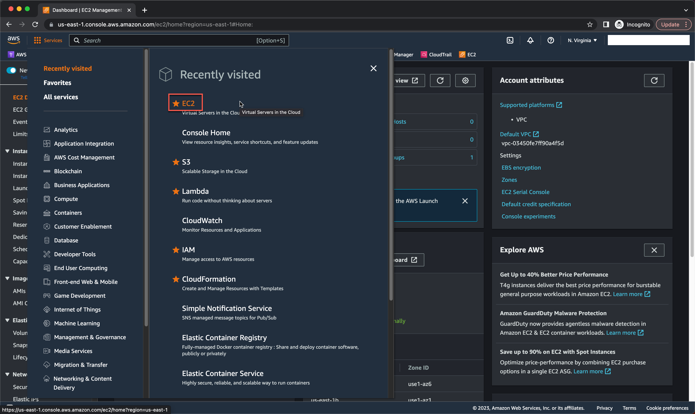

3. On the left panel, go to `Instances` and click on the button.

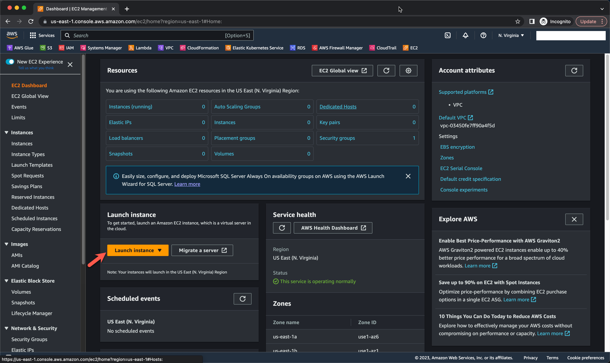

4. Enter `MyEC2Server` as the name.

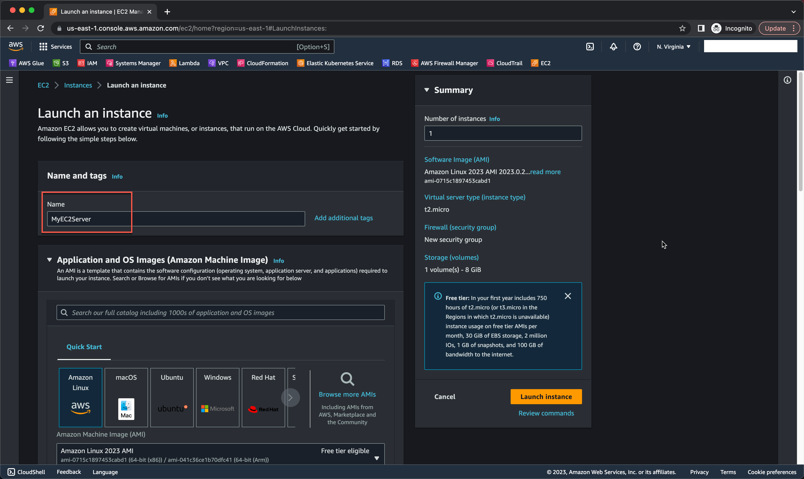

#### Application and OS Images (Amazon Machine Image)

1. For Quick Start: Select Amazon Linux 

2. For Amazon Machine Image (AMI): Select Amazon Linux 2023 AMI

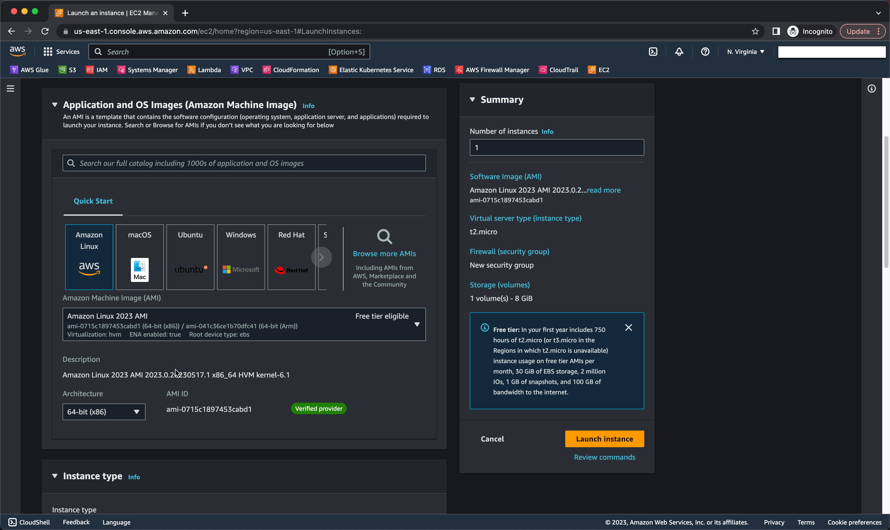

#### Instance type

1. For Instance Type: select t2.micro

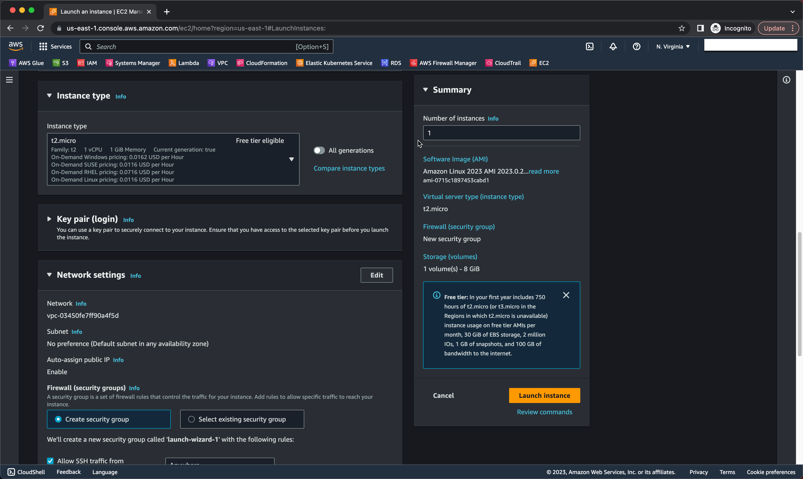

#### Key pair (login)

1. For Key pair: Select Create a new key pair Button

- Key pair name: KienTree-kp
- Key pair type: RSA
- Private key file format: .pem

2. Select `Create key pair` Button.

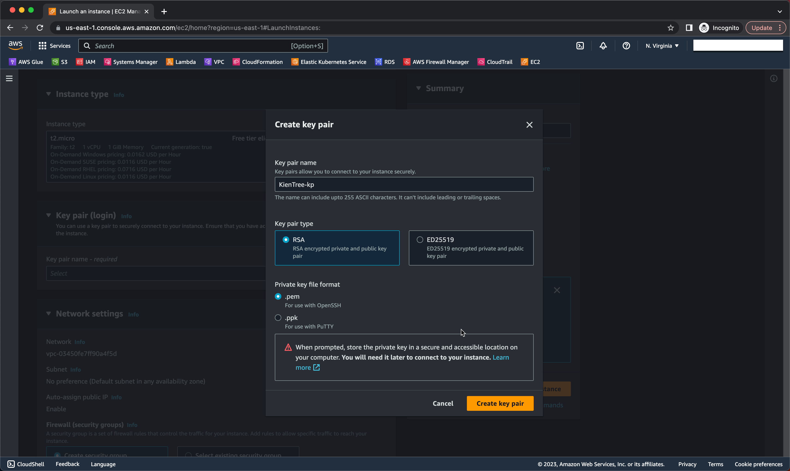

#### Network settings

1. Firewall (security groups): Create security group

2. Security group name: MyEC2Server-SG

3. Description: Security Group to allow traffic to EC2

4. Inbound security groups rules
- Click on `Add security group rule`
- Choose Type: HTTP 
- Source: Select `Anywhere`

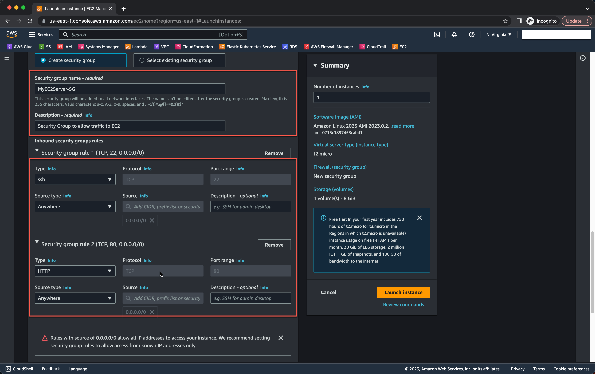

5. Keep the rest of the settings as default and click on the `Launch Instance` button.

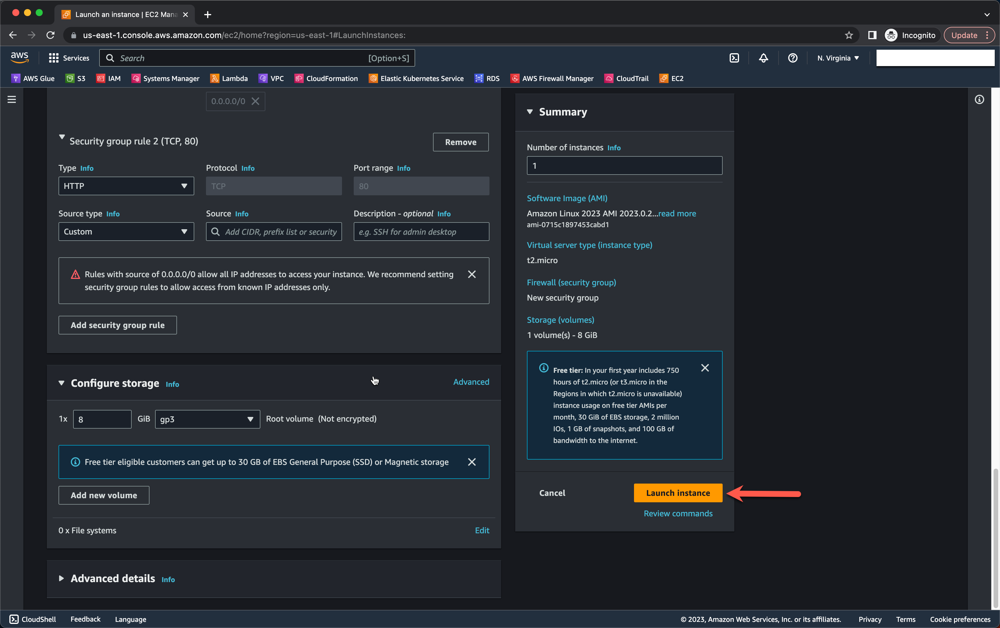

#### EC2 Instance Console

1. Select `View all Instances` to view the instance you created.

2. From the left menu, navigate to the `Instances` page and wait for the EC2 Instance's status to change to `Running` and the health check status to change to `2/2 checks passed`.

3. Take note of the sample IPv4 Public IP Address of the EC2 instance. An example is shown in the screenshot below.

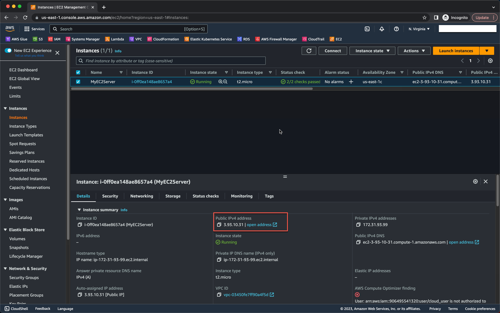

### Task 3: SSH into EC2 Instance using EC2 Instance Connect

1. Select your EC2 instance (`MyEC2Server`) and click on the `Connect` button.

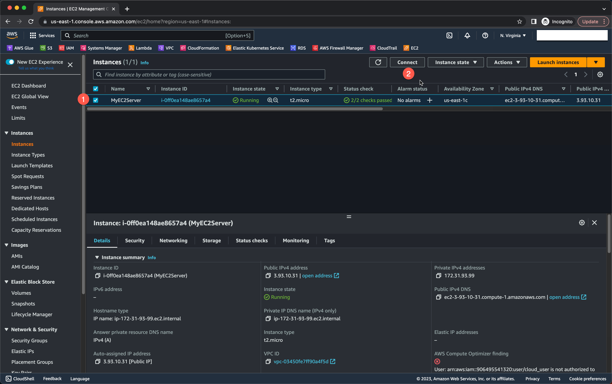

2. Choose the `EC2 Instance Connect` option and click on the `Connect` button. Keep all other settings as default.

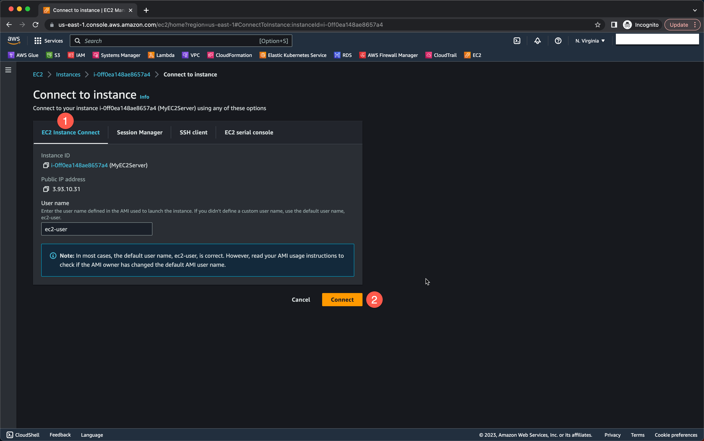

3. A new browser tab will open where you can execute CLI commands.

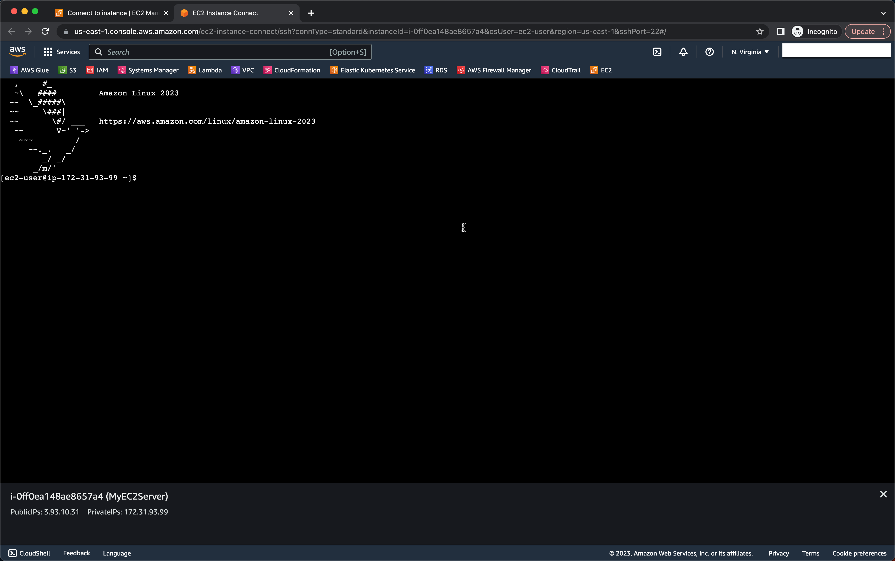

### Task 4: Install an Apache Server

1. Switch to root user:

```bash 
sudo su
```

2. Now run the updates using the following command:

```bash  
yum -y update
```

3. Install and run an Apache server:

- Install the Apache web server:

```bash 
yum install httpd -y
```

- Start the web server:

```bash
systemctl start httpd
```

- Enable httpd to start on boot:

```bash
systemctl enable httpd
```

- Check the status of the web server:

```bash
systemctl status httpd
```

- You should see an "Active" status indicating that the web server is running.

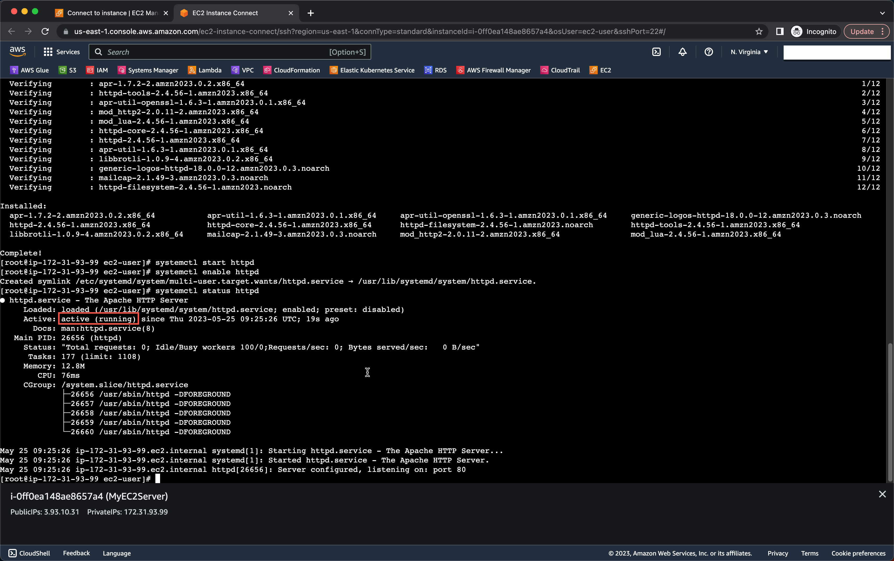

- Test your web server by entering the public IPv4 address of your EC2 instance in the address bar of a web browser. If the web server is properly installed and started, you should see the Apache test page. Sample URL: `http://3.93.10.31/`

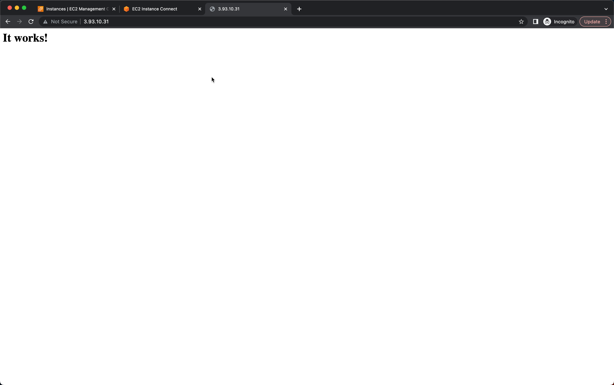

> Note: If you don't see the Apache test page, ensure that you have followed the above steps correctly and check the inbound rules of your security group.

### Task 5 : Create and publish the page

1. To add content to the `index.html` file using the `echo` command, copy and paste the following command into the shell:

```bash
echo "<html>Welcome to KienTree company home page</html>" > /var/www/html/index.html
```

2. Restart the web server by running the following command:

```bash
systemctl restart httpd
```

3. To view your HTML content, enter the file name `/index.html` after the public IPv4 address you obtained when you created the EC2 instance in the browser. Ensure that the URL protocol is `http`, not `https`.

- URL Syntax: `http://<Your_Public_IPv4_Address>/index.html`
- Sample URL: `http://3.93.10.31/index.html`

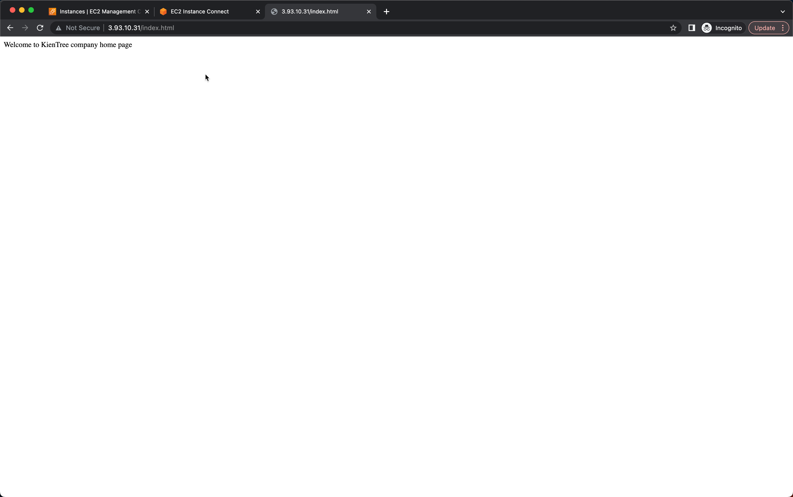

> Note: Ensure that the URL protocol is `http`, and not `https`, to access the webpage correctly.

## References

- [Amazon EC2 Documentation](https://docs.aws.amazon.com/AWSEC2/latest/UserGuide/concepts.html)
- [Connect to your Linux instance](https://docs.aws.amazon.com/AWSEC2/latest/UserGuide/connect-to-linux-instance.html)