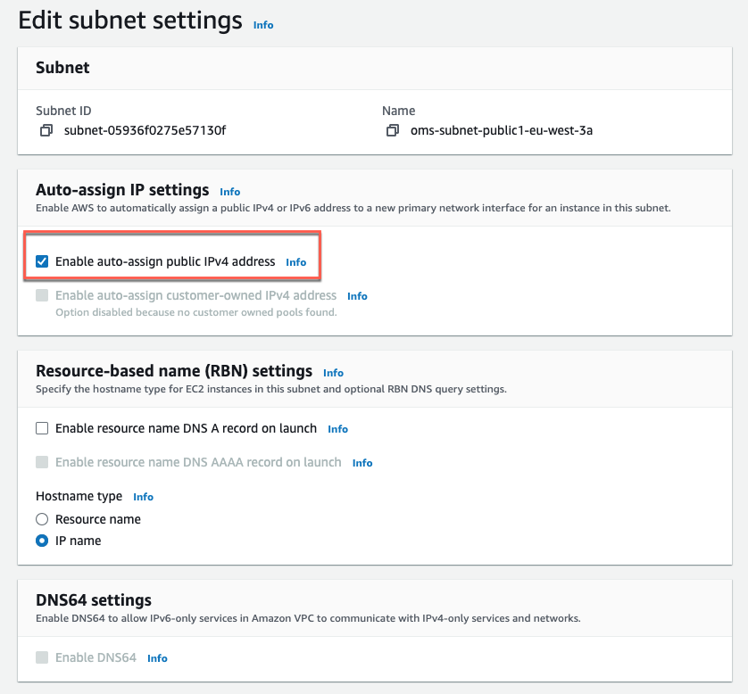

# Troubleshooting Cloud9 Connectivity Issues

## Table of Contents

- [Issue](#issue)
- [Solutions](#solutions)
- [Additional Tips](#additional-tips)
- [References](#references)

## Issue

Cloud9 could not connect to the EC2 instance. Please check your VPC configuration and network settings to troubleshoot the issue.

## Solutions

You need to enable the option "Auto-assign Public IPv4 Address" for the subnet where the Cloud9 instance is located.

1. **Navigate to the VPC Dashboard:**

- Open the AWS Management Console.
- Go to the VPC Dashboard.

2. **Select the Subnet:**

- In the left-hand navigation pane, click on "Subnets."
- Find and select the subnet where your Cloud9 instance is located.

3. **Modify Subnet Settings:**

- In the subnet details pane, click on the "Actions" dropdown menu.
- Select "Modify auto-assign IP settings."

4. **Enable Auto-assign Public IPv4 Address:**

- Check the box labeled "Enable auto-assign public IPv4 address."
- Click the "Save" button to apply the changes.

5. **Verify Cloud9 Connectivity:**

- Return to your Cloud9 environment and attempt to connect to the EC2 instance again.

## Additional Tips

- Ensure that your security groups and network ACLs are properly configured to allow traffic.
- Verify that your route tables are correctly set up to route traffic to and from the internet.
- Check that your EC2 instance has a valid IAM role attached with the necessary permissions for Cloud9 access.

## References

- [AWS Cloud9 User Guide](https://docs.aws.amazon.com/cloud9/latest/user-guide/troubleshooting.html) for further troubleshooting tips.
- [Troubleshooting AWS Cloud9](https://docs.aws.amazon.com/cloud9/latest/user-guide/troubleshooting.html)