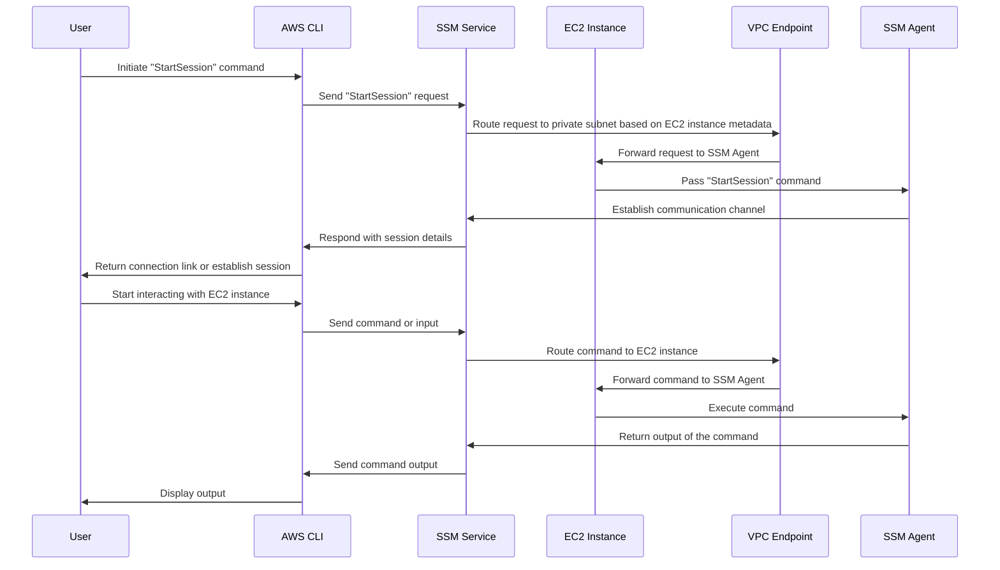

# Connect to EC2 in a Private Subnet Using Session Manager

## Table of Contents

- [Introduction](#introduction)
- [How It Works?](#how-it-works)
- [Setup Instructions](#setup-instructions)
    - [Step 1: Install Required Tools](#step-1-install-required-tools)
    - [Step 2: Launch an EC2 Instance with SSM Agent Preinstalled](#step-2-launch-an-ec2-instance-with-ssm-agent-preinstalled)
    - [Step 3: Create VPC Endpoints for Systems Manager Access](#step-3-create-vpc-endpoints-for-systems-manager-access)
    - [Step 4: Configure IAM Roles and Policies](#step-4-configure-iam-roles-and-policies)
    - [Step 5: Attach the IAM Role to EC2](#step-5-attach-the-iam-role-to-ec2)
    - [Step 6: Verify EC2 Instance in Fleet Manager](#step-6-verify-ec2-instance-in-fleet-manager)
- [Connecting to the EC2 Instance](#connecting-to-the-ec2-instance)
- [Best Practices](#best-practices)
- [Key Takeaways](#key-takeaways)
- [Conclusion](#conclusion)
- [References](#references)

## Introduction

Welcome! This guide will walk you through the process of connecting to an EC2 instance in a private subnet using AWS Session Manager. Session Manager is a feature of AWS Systems Manager that allows you to manage your EC2 instances through a browser-based shell or AWS CLI without the need to open inbound ports, manage bastion hosts, or use SSH keys. This approach enhances security, simplifies operations, and improves accessibility.

## How It Works?

The following sequence diagram illustrates the process of managing an EC2 instance using AWS Systems Manager (SSM) through the AWS CLI. It demonstrates how a user initiates a session, how the request is routed through the SSM service and VPC endpoint, and how commands are executed on the EC2 instance via the SSM Agent.

### Diagram



### Detailed Steps Explanation:

1. **User Initiates a Session**:

- The user initiates the session using the AWS CLI or the AWS Management Console.
- The AWS CLI sends the "StartSession" request to the Systems Manager (SSM) Service in the user's region.

2. **SSM Service Processes the Request**:

- The SSM Service identifies the target EC2 instance by its Instance ID.
- It retrieves the associated metadata (VPC ID, Subnet ID, and Region) for the instance.

3. **Determine the Correct VPC Endpoint**:

- The SSM Service determines the appropriate VPC Endpoint based on the instance's VPC and subnet information.
- The endpoint must be of type "Interface Endpoint" for Systems Manager and associated with the private subnets.

4. **Route Request via VPC Endpoint**:

- The SSM Service routes the request to the VPC Endpoint in the target VPC.
- The endpoint forwards the request securely to the EC2 instance within the private subnet.

5. **SSM Agent Processes the Request**:

- The SSM Agent running on the EC2 instance receives the "StartSession" command.
- It validates the request against the IAM Role attached to the instance (ensuring the necessary permissions are present).

6. **Establish Secure Communication**:

- Once validated, the SSM Agent establishes a secure, encrypted communication channel with the SSM Service.
- All communication is encrypted using TLS to ensure privacy and security.

7. **Respond to AWS CLI**:

- The SSM Service sends session details back to the AWS CLI or Management Console.
- The CLI displays the connection details, allowing the user to interact with the EC2 instance.

8. **User Interaction**:

- The user interacts with the EC2 instance by sending commands via the CLI or Console.
- These commands are forwarded through the SSM Service to the VPC Endpoint and then to the SSM Agent on the instance.

9. **Command Execution and Response**:

- The SSM Agent executes the commands on the EC2 instance.
- It sends the output back to the SSM Service, which forwards it to the AWS CLI or Console.

10. **Session Termination**:

- When the user ends the session, the SSM Agent terminates the communication channel.
- The session details are logged for auditing purposes in AWS CloudTrail or other logging services, if configured.

## Setup Instructions

### Step 1: Install Required Tools

Ensure you have the following tools installed on your local machine:

- **AWS CLI**: [Download and install AWS CLI](https://docs.aws.amazon.com/cli/latest/userguide/install-cliv2.html).

- **Session Manager Plugin**: Install the Session Manager plugin for AWS CLI:

```bash
curl "https://s3.amazonaws.com/session-manager-downloads/plugin/latest/mac/session-manager-plugin.pkg" -o "session-manager-plugin.pkg"
sudo installer -pkg session-manager-plugin.pkg -target /
```

For other operating systems, follow [this guide](https://docs.aws.amazon.com/systems-manager/latest/userguide/session-manager-working-with-install-plugin.html).

### Step 2: Launch an EC2 Instance with SSM Agent Preinstalled

To launch an EC2 instance from an Amazon Machine Image (AMI) with the SSM Agent preinstalled, follow these steps:

1. **Open the EC2 Console:**

- Navigate to the [Amazon EC2 Console](https://console.aws.amazon.com/ec2/).

2. **Launch Instance:**

- Click on **Launch Instance**.

3. **Choose an AMI:**

- Select an Amazon Machine Image (AMI) that has the SSM Agent preinstalled. You can use Amazon Linux 2, Ubuntu, or other supported AMIs. Look for AMIs with "SSM Agent preinstalled" in their description.

4. **Configure Instance Details:**

- Choose an instance type (e.g., `t2.micro` for free tier).
- Configure the instance details as needed, ensuring the instance is in a VPC and subnet that has internet access or a VPC endpoint for Systems Manager.

5. **Add Storage:**

- Configure the storage as needed.

6. **Add Tags:**

- Add any tags you need for your instance.

7. **Configure Security Group:**

- Create a new security group or select an existing one. Ensure that the security group allows the following outbound traffic:
    - **Outbound Rule**: Allow HTTPS traffic (TCP port 443) to the VPC endpoint private IPs or the Security Group ID used by the VPC endpoints. This is necessary for the SSM Agent to communicate with AWS Systems Manager.

8. **Review and Launch:**

- Review your instance configuration and click **Launch**.
- Select or create a key pair for SSH access and click **Launch Instances**.

### Step 3: Create VPC Endpoints for Systems Manager Access

To ensure your EC2 instance can communicate with AWS Systems Manager without requiring internet access, you need to create VPC endpoints for the necessary Systems Manager services. Follow these steps to create the VPC endpoints with a proper security group:

1. **Open the VPC Console**:

- Navigate to the [Amazon VPC Console](https://console.aws.amazon.com/vpc/).

2. **Create VPC Endpoints**:

- Click on **Endpoints** in the left-hand menu.
- Click on **Create Endpoint**.

3. **Create the Following VPC Endpoints**:

- **com.amazonaws.<region>.ssm**: For Systems Manager.
- **com.amazonaws.<region>.ssmmessages**: For Systems Manager Session Manager.
- **com.amazonaws.<region>.ec2messages**: For EC2 messages.

Replace `<region>` with your AWS region (e.g., `us-east-1`).

4. **Configure Endpoint Settings**:

- **Service Name**: Select the appropriate service name (e.g., `com.amazonaws.us-east-1.ssm`).
- **VPC**: Select the VPC where your EC2 instance is located.
- **Subnets**: Select the subnets where your EC2 instance is located.
- **Enable Private DNS Name**: Ensure this option is checked.

5. **Configure Security Group**:

- **Security Group**: Select or create a security group that allows HTTPS traffic (TCP port 443) from your EC2 instance. 
    - **Inbound Rule**: Allow HTTPS (TCP port 443) from the EC2 instance's Security Group.

6. **Create Endpoint**:

- Click on **Create Endpoint** to create the VPC endpoint.

**Note**: Repeat the above steps for each of the three VPC endpoints (`ssm`, `ssmmessages`, and `ec2messages`).

Your VPC endpoints are now configured, allowing your EC2 instance to communicate with AWS Systems Manager securely and efficiently.

### Step 4: Configure IAM Roles and Policies

1. **Create an IAM Role:**

- Go to the IAM console and create a new role.
- Choose "AWS service" and select "EC2."
- Attach the following policy: `AmazonSSMManagedInstanceCore`

2. **Configure Policy Permissions:**

- Ensure that the policies include permissions for `ssm:StartSession`, `ssm:DescribeSessions`, and `ec2messages:GetMessage`.

### Step 5: Attach the IAM Role to EC2

1. Navigate to the EC2 console.
2. Select the EC2 instance you wish to connect to.
3. Choose **Actions** > **Security** > **Modify IAM Role**.
4. Attach the role created in Step 2.

### Step 6: Verify EC2 Instance in Fleet Manager

1. Navigate to the AWS Systems Manager console.
2. In the left-hand navigation pane, choose **Fleet Manager** under **Node Management**.
3. Verify that your EC2 instance appears in the list of managed instances.
4. Ensure the instance status is **Online** and that it is properly managed by Systems Manager.

## Connecting to the EC2 Instance

1. Open your terminal and run the following command to start a session:

```bash
aws ssm start-session --target <instance-id>
```

Replace `<instance-id>` with your EC2 instance ID.

2. If successful, you will see a shell prompt for your EC2 instance:

```
Starting session with SessionId: user-12345678...
$
```

3. To terminate the session, type `exit`.

## Best Practices

- **Restrict IAM Permissions:** Use least privilege principles when creating IAM roles and policies.
- **Enable Logging:** Configure AWS CloudTrail and Systems Manager Session Manager to log all session activities for auditing purposes.
- **Patch Your EC2 Instances:** Regularly update your EC2 instances to ensure that the SSM Agent is up-to-date.
- **Monitor Sessions:** Use AWS Config and CloudWatch to monitor session activities in real time.

## Key Takeaways

- AWS Session Manager eliminates the need for bastion hosts and SSH keys, enhancing security.
- IAM roles and policies play a critical role in configuring secure access.
- Logging and monitoring are essential for maintaining an auditable and secure environment.

## Conclusion

AWS Session Manager is a powerful tool for managing EC2 instances securely and efficiently. By following the steps in this guide, you can connect to EC2 instances in private subnets without compromising security. Remember to adhere to best practices and continually monitor your AWS environment for optimal performance and security.

## References

- [AWS Session Manager Documentation](https://docs.aws.amazon.com/systems-manager/latest/userguide/session-manager.html)
- [IAM Policies for Session Manager](https://docs.aws.amazon.com/systems-manager/latest/userguide/getting-started-restrict-access.html)
- [AWS CLI Documentation](https://docs.aws.amazon.com/cli/latest/userguide/cli-chap-welcome.html)
- [How do I install SSM Agent on an Amazon EC2 Linux instance at launch?](https://repost.aws/knowledge-center/install-ssm-agent-ec2-linux)
- [Setting up Session Manager](https://docs.aws.amazon.com/systems-manager/latest/userguide/session-manager-getting-started.html)