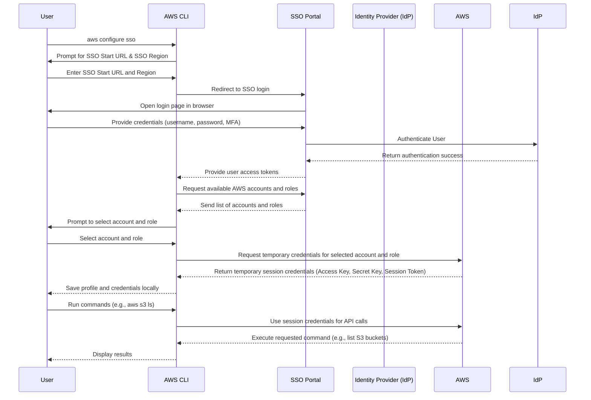

# Configuring AWS Profile with SSO

Welcome to this guide on configuring your AWS profile using Single Sign-On (SSO). If you're new to AWS, SSO, or the AWS Command Line Interface (CLI), this guide will help you understand how to set up your local environment with AWS credentials using SSO for seamless access. By the end of this document, you will be able to configure and manage your AWS profiles, enabling you to work more efficiently within multiple AWS environments.

## Table of Contents

- [Introduction](#introduction)
- [Prerequisites](#prerequisites)
- [Setting Up AWS CLI](#setting-up-aws-cli)
- [How AWS SSO Works?](#how-aws-sso-works)
- [Benefits of Using SSO](#benefits-of-using-sso)
- [Configuring AWS SSO Profile](#configuring-aws-sso-profile)
    - [Step 1: Initializing AWS SSO Configuration](#step-1-initializing-aws-sso-configuration)
    - [Step 2: Selecting AWS Accounts and Roles](#step-2-selecting-aws-accounts-and-roles)
    - [Step 3: Verifying Configuration](#step-3-verifying-configuration)
- [Using AWS SSO Profiles](#using-aws-sso-profiles)
- [Best Practices](#best-practices)
- [Key Takeaways](#key-takeaways)
- [Conclusion](#conclusion)
- [References](#references)

## Introduction

AWS Single Sign-On (SSO) provides a centralized way to manage access to AWS accounts and third-party applications. It allows you to authenticate users through a unified identity source, such as your corporate directory, and apply permissions across various AWS accounts.

In this guide, we'll focus on configuring the AWS CLI to use SSO for accessing your AWS resources. This setup is particularly useful if you manage multiple AWS accounts or need to switch between different roles and permissions without constantly updating credentials.

## Prerequisites

Before you get started, make sure you have the following:

- **AWS CLI version 2**: AWS SSO configuration requires AWS CLI version 2. [Download AWS CLI v2](https://docs.aws.amazon.com/cli/latest/userguide/install-cliv2.html)
- **AWS SSO access**: You should have permission to use AWS SSO in your organization. Ask your administrator if you're unsure.
- **SSO URL and credentials**: You’ll need the AWS SSO portal URL provided by your administrator.

## How AWS SSO Works?

To better understand how AWS SSO works with the AWS CLI, the following sequence diagram illustrates the process flow from configuring the SSO profile to running commands using temporary credentials.



### **Explanation:**

1. The user runs the `aws configure sso` command to start setting up AWS SSO in their AWS CLI.
2. AWS CLI prompts for the SSO Start URL and region.
3. The user is redirected to the AWS SSO portal for login and authentication.
4. The user provides login credentials, and the Identity Provider (IdP) validates the authentication.
5. AWS SSO issues access tokens, which AWS CLI uses to request available AWS accounts and roles.
6. The user selects the desired account and role, after which AWS CLI requests temporary credentials from AWS.
7. AWS returns the temporary credentials, which are stored locally in the user's AWS profile configuration.
8. The user can now execute AWS CLI commands using the selected profile, and the AWS CLI uses the temporary credentials to interact with AWS services.

## Benefits of Using SSO

Using AWS SSO (AWS Identity Center) comes with several advantages over traditional long-term access key management:

### 1. **Enhanced Security**

- With AWS SSO, there is no need to store long-term credentials (like Access Key ID and Secret Access Key) on your local machine. Instead, you use temporary credentials that expire after a short period, reducing the risk of credential exposure.
- The use of Single Sign-On integrates with your organization’s identity provider (such as Microsoft Azure AD or Okta), which often includes additional security features like Multi-Factor Authentication (MFA).
- Centralized control over user access and permissions simplifies monitoring and auditing, improving overall security posture.

### 2. **Centralized User Management**

- AWS SSO allows organizations to manage access to multiple AWS accounts from a single place. Administrators can assign roles, permissions, and access policies centrally, making it easier to control who has access to which resources.
- User access can be granted or revoked in real time through the SSO system, ensuring that access is up-to-date and compliant with organizational policies.

### 3. **Seamless Multi-Account Access**

- If you work with multiple AWS accounts, AWS SSO makes it easy to switch between accounts and roles without needing to manage multiple sets of credentials. After logging in once through the SSO portal, you can seamlessly switch between accounts using different AWS CLI profiles.
- This is particularly useful for organizations that manage environments like production, staging, and development across multiple AWS accounts.

### 4. **No Credential Management Hassle**

- With AWS SSO, you no longer need to manually rotate, store, or manage long-term credentials. The AWS CLI fetches temporary session credentials from the AWS SSO service, and these are automatically refreshed when needed.
- You are prompted to authenticate only when your session expires, making it convenient and time-efficient.

### 5. **Compliance and Auditability**

- AWS SSO provides enhanced auditing and compliance features. You can track who has logged into what AWS accounts, what roles were assumed, and when sessions were started and ended.
- This is particularly useful for organizations with stringent compliance requirements like HIPAA or SOC2, as access and activity logs can be centrally managed and reviewed.

## Setting Up AWS CLI

If you haven't installed AWS CLI v2 yet, follow these steps:

1. **Download and install the AWS CLI**  

Follow the installation guide for your operating system:

- [Windows](https://docs.aws.amazon.com/cli/latest/userguide/install-cliv2-windows.html)
- [macOS](https://docs.aws.amazon.com/cli/latest/userguide/install-cliv2-mac.html)
- [Linux](https://docs.aws.amazon.com/cli/latest/userguide/install-cliv2-linux.html)

2. **Verify the installation**

Once installed, open a terminal or command prompt and run:

```bash
aws --version
```

This should display the version number of the AWS CLI (v2.x.x).

## Configuring AWS SSO Profile

Now, let's configure your AWS profile with SSO. This will allow you to authenticate using your organization's SSO provider.

### Step 1: Initializing AWS SSO Configuration

To start the configuration process, run the following command in your terminal:

```bash
aws configure sso
```

You'll be prompted to provide information:

- **SSO Start URL**: Enter the URL for your AWS SSO portal (provided by your administrator).
- **SSO Region**: Choose the AWS region where your SSO is configured.
- **SSO Session Name**: You can specify a session name or leave it blank for the default.
- **SSO Account and Role Selection**: You'll be guided through selecting the AWS account and IAM role to use.

### Step 2: Selecting AWS Accounts and Roles

After providing your SSO URL and region, you'll be redirected to a browser for authentication. Once authenticated, you'll return to the terminal to select the AWS account and role you'd like to configure. You can manage multiple accounts and roles under different profiles by repeating this process.

Here is an example configuration for AWS CLI profiles using AWS SSO:

```ini
[profile my-sso-admin-profile]
sso_start_url = https://my-sso-portal.awsapps.com/start
sso_region = us-east-1
sso_account_id = 123456789011
sso_role_name = AWSAdministratorAccess

[profile my-sso-poweruser-profile]
sso_start_url = https://my-sso-portal.awsapps.com/start
sso_region = us-east-1
sso_account_id = 123456789011
sso_role_name = PowerUserAccess
```

In this example:

- **sso_start_url**: The URL for your AWS SSO portal.
- **sso_region**: The AWS region where your SSO is configured.
- **sso_account_id**: The AWS account ID you want to access.
- **sso_role_name**: The IAM role you want to assume.

### Step 3: Verifying Configuration

After completing the configuration steps, your profile will be saved in the AWS configuration file (`~/.aws/config`). To verify the setup, list all configured profiles:

```bash
aws configure list-profiles
```

Your newly created profile should appear in the list. 

## Using AWS SSO Profiles

Once configured, you can use the profile to interact with AWS services. For example, if your profile name is `my-sso-admin-profile`, you can run commands like this:

```bash
aws s3 ls --profile my-sso-admin-profile
```

### Example Commands

- List all S3 buckets:

```bash
aws s3 ls --profile my-sso-admin-profile
```

- Describe EC2 instances:

```bash
aws ec2 describe-instances --profile my-sso-admin-profile
```

- Switch between multiple profiles:

```bash
aws sts get-caller-identity --profile my-sso-poweruser-profile
```

## Best Practices

- **Use meaningful profile names**: Name your profiles in a way that clearly indicates the environment or purpose, such as `prod-account`, `dev-account`, or `admin-role`.
- **Keep credentials secure**: Do not share your AWS credentials, even if they are temporary.
- **Use multi-factor authentication (MFA)**: If available, always enable MFA for an extra layer of security.
- **Automate session refresh**: Use AWS SSO's automatic session refreshing to avoid interruptions due to expired credentials.
- **Regularly review account access**: Ensure that you regularly review your role and account access to maintain least privilege.

## Key Takeaways

- AWS SSO simplifies managing access across multiple AWS accounts using a single identity provider.
- AWS CLI v2 is required for configuring AWS profiles with SSO.
- SSO profiles allow you to switch between different accounts and roles without manual credential management.
- Using best practices, such as meaningful profile names and MFA, helps secure your AWS environment.

## Conclusion

In this guide, we covered how to configure your AWS profile with Single Sign-On using the AWS CLI. We walked through the necessary steps, from installing the CLI to setting up and using an SSO profile. This setup enables efficient and secure access to multiple AWS environments, reducing the friction of managing credentials manually.

## References

- [AWS CLI Official Documentation](https://docs.aws.amazon.com/cli/latest/userguide/cli-configure-sso.html)
- [AWS Single Sign-On](https://aws.amazon.com/single-sign-on/)
- [Best Practices for AWS SSO](https://docs.aws.amazon.com/singlesignon/latest/userguide/best-practices.html)
- [AWS CLI v2 Installation Guide](https://docs.aws.amazon.com/cli/latest/userguide/install-cliv2.html) 