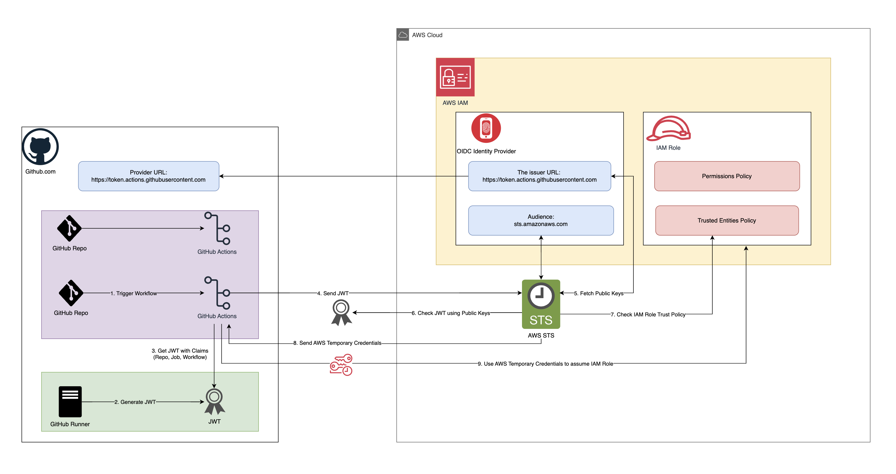

# Creating an OIDC Identity Provider for GitHub Actions

## Table of Contents

- [Introduction](#introduction)
- [What is OIDC?](#what-is-oidc)
- [Why Use OIDC with GitHub Actions?](#why-use-oidc-with-github-actions)
- [How GitHub Actions authenticates with AWS using OIDC?](#how-github-actions-authenticates-with-aws-using-oidc)
- [Setting Up OIDC Identity Provider in AWS](#setting-up-oidc-identity-provider-in-aws)
- [Best Practices](#best-practices)
- [Key Takeaways](#key-takeaways)
- [Conclusion](#conclusion)
- [References](#references)

## Introduction

Welcome to the comprehensive guide on setting up an OpenID Connect (OIDC) Identity Provider for GitHub Actions. This document is designed to help developers and DevOps professionals integrate OIDC with GitHub Actions to enhance the security and efficiency of their CI/CD workflows. By the end of this guide, you'll understand how to configure GitHub Actions to authenticate with cloud services using OIDC, specifically within the Amazon Web Services (AWS) environment.

## What is OIDC?

OpenID Connect (OIDC) is an authentication protocol that allows systems to verify the identity of an end-user based on the authentication performed by an authorization server. It extends OAuth 2.0 to add an identity layer, thereby enabling client applications to rely on authentication that is performed by an Identity Provider (IdP).

## Why Use OIDC with GitHub Actions?

Integrating OIDC with GitHub Actions allows you to:

- **Enhance Security**: Eliminate the need for long-lived credentials by using short-lived tokens.
- **Streamline Operations**: Automatically manage credentials and permissions through identity provider configurations.
- **Compliance and Traceability**: Improve audit trails by linking actions and accesses directly to individual GitHub accounts.

## How GitHub Actions authenticates with AWS using OIDC?

GitHub Actions authenticates with AWS using OpenID Connect (OIDC) by establishing a secure and streamlined method to assume AWS IAM roles. This process eliminates the need for storing sensitive AWS credentials in your GitHub repositories. Here's how it works:



1. **Trigger GitHub Actions Workflow**:

- A GitHub Actions workflow is initiated due to an event like a push or a pull request on a repository.

2. **GitHub Generates JWT**:

- When a GitHub Actions workflow is triggered, it is executed on a runner. As part of the workflow execution, the runner generates a JWT. This token includes claims that are specific to the job, such as the repository name, the workflow, and other context-specific data.

3. **Retrieves JWT with Claims**:

- The GitHub Actions workflow retrieves the JWT generated by the GitHub Runner.

- The JWT specifically includes claims that identify the action being performed, the repository involved, and any other relevant data that AWS might require to authenticate the request.

4. **Send JWT to AWS STS**:

- The GitHub Actions workflow uses the generated JWT to request access from AWS. This is done by calling the AWS Security Token Service (STS) with the `AssumeRoleWithWebIdentity` API method.

5. **AWS STS Fetches Public Keys**

- **Retrieve Public Keys**: Before verifying the JWT, AWS STS fetches the public keys from GitHub's OIDC provider URL (`https://token.actions.githubusercontent.com`). These keys are necessary to verify the signature of the JWT.

6. **AWS STS Verifies JWT**:

- AWS STS verifies the JWT's authenticity and integrity. It does this by checking the JWT's signature against the public keys that AWS retrieves from GitHub's OIDC provider URL (e.g., `https://token.actions.githubusercontent.com`).

- AWS also checks the `aud` (Audience) claim in the JWT to ensure it is intended for AWS (typically `sts.amazonaws.com`).

7. **AWS Checks IAM Role Trust Policy**:

- AWS evaluates the trust policy of the IAM role that the GitHub Actions workflow is attempting to assume. This policy dictates which principals (identities) can assume the role and under what conditions.

- The policy might specify conditions that include requiring certain claims in the JWT, such as the specific GitHub repository or branch.

8. **Access Granted and Assume IAM Role**:

- If the JWT is valid and the conditions in the IAM role's trust policy are met, AWS STS grants the GitHub Actions workflow temporary security credentials.

- These credentials allow the workflow to assume the specified IAM role and perform actions in AWS as permitted by the role's permissions.

9. **Perform AWS Actions**:

- With the IAM role assumed, the GitHub Actions workflow can now perform the AWS actions defined in the role's permissions, such as deploying resources, managing services, or updating configurations.

## Setting Up OIDC Identity Provider in AWS

Creating an OIDC Identity Provider within AWS IAM allows GitHub Actions to authenticate with AWS services securely using identity-based connections. Follow these detailed steps to establish the provider:

1. **Access the AWS Management Console**:

- Open your web browser and sign in to the [AWS Management Console](https://aws.amazon.com/console/).

2. **Navigate to IAM**:

- In the AWS Management Console, find and select **IAM** (Identity and Access Management) from the services menu to manage access to your AWS resources.

3. **Go to Identity Providers**:

- Within the IAM dashboard, click on **Identity providers** on the left-hand menu. This section allows you to manage third-party identity providers that can be used to authenticate users.

4. **Add a New Provider**:

- Click on **Add provider** to start the setup of a new OIDC identity provider. Choose **OpenID Connect** as the provider type.

5. **Configure the Provider**:

- **Provider URL**: This is the URL where AWS will send requests to authenticate users. For GitHub Actions, the URL is `https://token.actions.githubusercontent.com`.

- **Audience**: The audience is a string that identifies the intended recipients of the returned information. For this setup, use `sts.amazonaws.com` which is the AWS Security Token Service that will accept the OIDC tokens.

```plaintext
Provider URL: https://token.actions.githubusercontent.com
Audience: sts.amazonaws.com
```

6. **Add Thumbprint**:

- A server certificate thumbprint is required to establish trust between AWS and the OIDC provider. This thumbprint is the hex-encoded SHA-1 hash of the certificate used by the provider. AWS often pre-fills this for well-known providers, but you may need to provide it manually if not automatically detected.

7. **Create the OIDC Provider**:

- Review the configurations to ensure they are correct, then click on **Create** to finalize the creation of the OIDC identity provider.

8. **Verify the Setup**:

- Once created, the new OIDC identity provider will appear in the list under **Identity providers**. Ensure that the details are correct and reflect the configurations intended for your GitHub Actions setup.

## Best Practices

- **Secure Your IAM Roles**: Apply the principle of least privilege by granting only necessary permissions.
- **Monitor and Audit**: Regularly review access and authentication logs.
- **Regularly Rotate Secrets**: Although OIDC reduces the need for managing secrets, it's still crucial to rotate any remaining secrets periodically.

## Key Takeaways

- **Leverage OIDC for Secure Authentication**: Using OIDC for authentication between GitHub Actions and AWS removes the need for storing and managing static credentials, enhancing security.
- **Dynamic Credential Management**: By using JWTs that are dynamically generated and short-lived, you reduce the risk of token leakage and unauthorized access.
- **Role-Based Access**: GitHub Actions can assume AWS IAM roles based on the JWT claims, allowing for fine-grained access control based on the specifics of the job, such as the repository or branch involved.
- **Dynamic Key Management**: By fetching public keys from GitHub’s JWKS endpoint, AWS can dynamically validate the JWTs, ensuring the authentication process remains secure even when GitHub rotates its keys.

## Conclusion

Implementing OIDC with GitHub Actions represents a significant step towards more secure and efficient DevOps practices. By following the guidelines outlined in this document, you can ensure a seamless integration that not only simplifies your workflows but also fortifies your deployments.

## References

- [Configuring AWS Credentials GitHub Action](https://github.com/aws-actions/configure-aws-credentials)
- [Configuring OpenID Connect in Amazon Web Services](https://docs.github.com/en/actions/deployment/security-hardening-your-deployments/configuring-openid-connect-in-amazon-web-services)
- [Create an OpenID Connect (OIDC) identity provider in IAM](https://docs.aws.amazon.com/IAM/latest/UserGuide/id_roles_providers_create_oidc.html#manage-oidc-provider-console)
- [Configuring a role for GitHub OIDC identity provider](https://docs.aws.amazon.com/IAM/latest/UserGuide/id_roles_create_for-idp_oidc.html#idp_oidc_Create_GitHub)