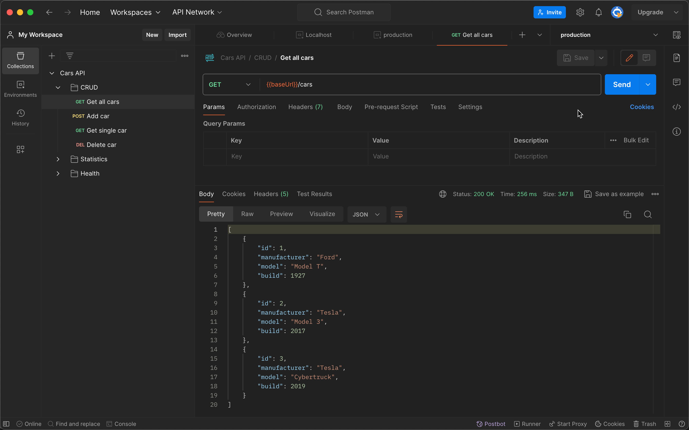

# Deploying Java App to AWS Beanstalk using AWS Console

## Table of Contents

- [Introduction](#introduction)
- [Prerequisites](#prerequisites)
    - [Creating an Instance Profile](#creating-an-instance-profile)
- [Getting Started with AWS Elastic Beanstalk](#getting-started-with-aws-elastic-beanstalk)
    - [Accessing AWS Management Console](#accessing-aws-management-console)
    - [Navigating to Elastic Beanstalk](#navigating-to-elastic-beanstalk)
- [Creating Your Application](#creating-your-application)
    - [Naming Your Application](#naming-your-application)
- [Setting Up Your Environment](#setting-up-your-environment)
    - [Configuring environment](#configuring-environment)
    - [Configuring service access](#configuring-service-access)
    - [Configuring Networking and Database](#configuring-networking-and-database)
    - [Configuring Instance Traffic and Scaling](#configuring-instance-traffic-and-scaling)
    - [Updates, monitoring, and logging](#updates-monitoring-and-logging)
- [Deploying Your Application](#deploying-your-application)
    - [Uploading and Deploying Your Own Application](#uploading-and-deploying-your-own-application)
- [Verifying Deployment](#verifying-deployment)
    - [Checking Application Health](#checking-application-health)
    - [Accessing Your Deployed Application](#accessing-your-deployed-application)
    - [Testing with Postman](#testing-with-postman)
- [Troubleshooting](#troubleshooting)
- [Best Practices](#best-practices)
- [Key Takeaways](#key-takeaways)
- [Conclusion](#conclusion)
- [References](#references)

## Introduction

Welcome to our comprehensive guide on deploying applications to AWS using AWS Management Console! This document is designed to help beginners navigate the complexities of AWS deployment, focusing on the use of AWS Elastic Beanstalk for deploying web applications. Whether you're deploying your first application or looking to refine your process, this guide provides step-by-step instructions, best practices, and key takeaways to ensure a smooth deployment process. Let's dive in and get your application up and running on AWS!

## Prerequisites

### Creating an Instance Profile

An instance profile acts as a wrapper around an IAM role, allowing EC2 instances to assume that role. You can create instance profiles tailored to specific applications or limit them if certain services are not utilized.

1. **Navigate to the IAM Console**:

- Open the [IAM console](https://console.aws.amazon.com/iam/).
- Go to the **Roles** page.

2. **Create a New Role**:

- Click **Create role**.
- For the trusted entity type, select **AWS service**.
- For the use case, choose **EC2** to allow EC2 instances to assume this role.

3. **Attach Policies**:

- Proceed to **Next** and attach the necessary Elastic Beanstalk managed policies. Additionally, attach any other policies that your application requires for operation.
- Use the search bar to filter by typing `AWSElasticBeanstalk`.
- Select the necessary policies for your environment, such as:
    - `AWSElasticBeanstalkWebTier`
    - `AWSElasticBeanstalkWorkerTier`
    - `AWSElasticBeanstalkMulticontainerDocker`
- Click **Attach policy** to apply these to your role.

4. **Finalize Role Creation**:

- After attaching policies, click **Next**.
- Enter a name for the role, such as `aws-elasticbeanstalk-ec2-role`.
- Optionally, add tags to the role.
- Click **Create role** to finalize.

## Getting Started with AWS Elastic Beanstalk

### Accessing AWS Management Console

To begin, navigate to the AWS Management Console. You can search for specific services using the search bar or browse through all services. Given that deployment requires computing power, we'll focus on the "Compute" category, specifically "Elastic Beanstalk".

### Navigating to Elastic Beanstalk

- In the AWS Management Console, either search for "Elastic Beanstalk" directly or click on "All Services" and find it under "Compute".
- Once you're in the Elastic Beanstalk dashboard, we're ready to create a new application.

## Creating Your Application

### Naming Your Application

- Click on "Create application".
- Name your application (e.g., "cars-API").
- Click on "Create".

## Setting Up Your Environment

### Configuring environment

- Your application needs an environment to run. Click to create a new environment.
- Choose "Web server environment".
- Name your environment (e.g., "production").
- Leave the domain as default for automatic generation.
- For "Pre-configured platform", select the platform that matches your application (e.g., Java).

Initially, start with a sample application to understand how the environment works.

- Select "Sample application".
- Click on "Next".

### Configuring service access

Elastic Beanstalk requires specific roles and permissions to manage resources on your behalf:

#### Service Access

- Elastic Beanstalk uses IAM roles and EC2 instance profiles to manage the environment on your behalf. These roles allow Elastic Beanstalk to perform actions like resource creation and management within AWS.
- In Amazon Web Services (AWS) Elastic Beanstalk, different roles are used to grant permissions to various components of the Elastic Beanstalk environment. Specifically, the `aws-elasticbeanstalk-service-role` and `aws-elasticbeanstalk-ec2-role` serve different purposes:

1. **aws-elasticbeanstalk-service-role**: This role is assumed by the Elastic Beanstalk service itself. It provides the service with the necessary permissions to call other AWS services on your behalf to manage the resources that run your application. For example, this role allows Elastic Beanstalk to access AWS services like EC2, S3, CloudWatch, etc., to create, manage, and monitor the resources needed for your application. This role is crucial for Elastic Beanstalk to perform its operations, such as setting up load balancers, managing auto-scaling groups, or handling deployments.

2. **aws-elasticbeanstalk-ec2-role** (commonly referred to as the "instance profile" or "EC2 role"): This role is assigned to the EC2 instances that are launched as part of your Elastic Beanstalk environment. It grants permissions that these instances need to interact with other AWS services. For example, this role might include permissions to read from an S3 bucket where your application's code or logs are stored, write logs to CloudWatch, send metrics to CloudWatch, or access a database on RDS. Essentially, this role defines what the servers themselves are authorized to do within AWS while running your application.

In summary, the `aws-elasticbeanstalk-service-role` is used by the Elastic Beanstalk service to manage the environment and its resources, while the `aws-elasticbeanstalk-ec2-role` provides permissions to the individual EC2 instances within that environment to allow them to operate correctly and securely interact with other AWS services.

#### Service Role

- **Create and Use a New Service Role**: For a new deployment, you can allow Elastic Beanstalk to create a new service role equipped with the necessary permissions.
- **Use an Existing Service Role**: If you already have an IAM role with the required permissions, you can choose to use this existing role. This is useful if you have specific compliance or configuration needs.

**IAM Roles and Instance Profiles**: Ensure both the IAM role (service role) and the EC2 instance profile attached to your environment have the correct IAM managed policies. These policies grant the necessary permissions for Elastic Beanstalk to operate correctly.

- For a new setup, Elastic Beanstalk can guide you through creating a service role with the appropriate permissions.
- If opting to use an existing service role, ensure it has the necessary permissions by attaching IAM managed policies that cover the required actions.
- In our example, we'll opt for Elastic Beanstalk to create a new service role. This choice streamlines the process, ensuring the new service role is automatically endowed with the necessary permissions.
- By selecting "Create and use a new service role", you enable Elastic Beanstalk to handle the creation and assignment of a service role that has the appropriate permissions predefined. This is the recommended approach for new deployments, simplifying the setup and ensuring your environment has the permissions it needs to operate smoothly.
- This action will establish a new service role, designated as `aws-elasticbeanstalk-service-role`.

#### EC2 instance profile

- Select the `aws-elasticbeanstalk-ec2-role` created in the [previous section](#creating-an-instance-profile).
- Click on "Next".

### Configuring Networking and Database

As part of setting up your environment, configuring the network and database settings is critical for ensuring your application's accessibility and scalability.

- **Choose the Default VPC**: Start by selecting the default VPC provided by AWS. This simplifies the configuration process and is suitable for most applications.
- **Specify Instance Subnets in 2 AZs**: To ensure high availability, specify 2 instance subnets located in 2 different Availability Zones (AZs). For this setup, use `us-east-1c` and `us-east-1a`. This configuration helps in distributing your instances across multiple locations, thereby enhancing the fault tolerance of your application.

### Configuring Instance Traffic and Scaling

- **Choose the Default EC2 Security Groups**: For the security of your instances, select the default EC2 security groups provided by AWS.

### Updates, monitoring, and logging

- **Leave this step as default and click on "Submit"**:
    - **Step 5 - Optional**: Configure updates, monitoring, and logging. This step involves setting preferences for how your environment receives software updates, how it's monitored, and how logs are managed.

## Deploying Your Application

### Uploading and Deploying Your Own Application

Once you're comfortable, it's time to deploy your actual application.

- Navigate to "Upload and deploy".
- Choose the JAR file for your application. If you don't have the JAR file on your computer, you can download the "cars-api.jar" from the resources directory [resources directory](./resources/).
- After selecting the JAR file, click "Deploy".
- AWS will upload the new application version and deploy it on the created instance. This process may take a few minutes.

## Verifying Deployment

### Checking Application Health

After deployment, ensure the application's health status is okay. This indicates a successful deployment.

### Accessing Your Deployed Application

- The overview page will display your application's URL.
- Access the URL to view your deployed application.

### Testing with Postman

To test your deployed API, you can use Postman, a popular API testing tool.

1. **Setting Up Postman Environment**:

- Open Postman and click on the first icon on the right sidebar to manage environments.

- Create a new environment named "production".

- For the environment URL, use the address generated by AWS Elastic Beanstalk for your deployed application. Ensure it is prefixed with `http://` and does not contain any trailing spaces or new lines.

2. **Switching Environments**:

- In Postman, beside the environment dropdown, select "production" to switch from testing locally to testing your production API deployed on AWS.

3. **Testing API Endpoints**:

- Use the relevant API endpoints to test the functionality of your application. For instance, if you have an endpoint to get all cars, use it to verify that the application returns the expected response.

- To test further, you can add a new car using a POST request and then call the GET request again to see if the new car has been added successfully.

## Troubleshooting

If you encounter any issues while deploying or managing your application with AWS Elastic Beanstalk, please refer to our [Troubleshooting guide](TROUBLESHOOTING.md) for detailed steps on resolving common problems.

## Best Practices

- Always start with a sample application to familiarize yourself with the deployment environment.
- Verify the health status post-deployment to ensure everything is running smoothly.
- Use environment management tools like Postman to test API endpoints after deployment.

## Key Takeaways

- Deploying to AWS using Elastic Beanstalk is straightforward with a clear process.
- Ensuring your application environment is correctly set up is crucial for successful deployment.
- Regularly checking the health status and functionality of your deployed application is essential.

## Conclusion

Deploying applications on AWS using manual uploads can initially seem daunting. However, with this guide, we've broken down the process into manageable steps, ensuring that even beginners can confidently deploy their applications. Remember, the key to successful deployment lies in careful preparation, understanding the AWS environment, and continuous monitoring post-deployment. We hope this guide has been helpful in your AWS deployment journey. Happy deploying! 🚀

## References

- [AWS Elastic Beanstalk Documentation](https://aws.amazon.com/elasticbeanstalk/)
- [Getting started using Elastic Beanstalk](https://docs.aws.amazon.com/elasticbeanstalk/latest/dg/GettingStarted.html)
- [Postman Official Website](https://www.postman.com/)
- [Postman Learning Center](https://learning.postman.com/)