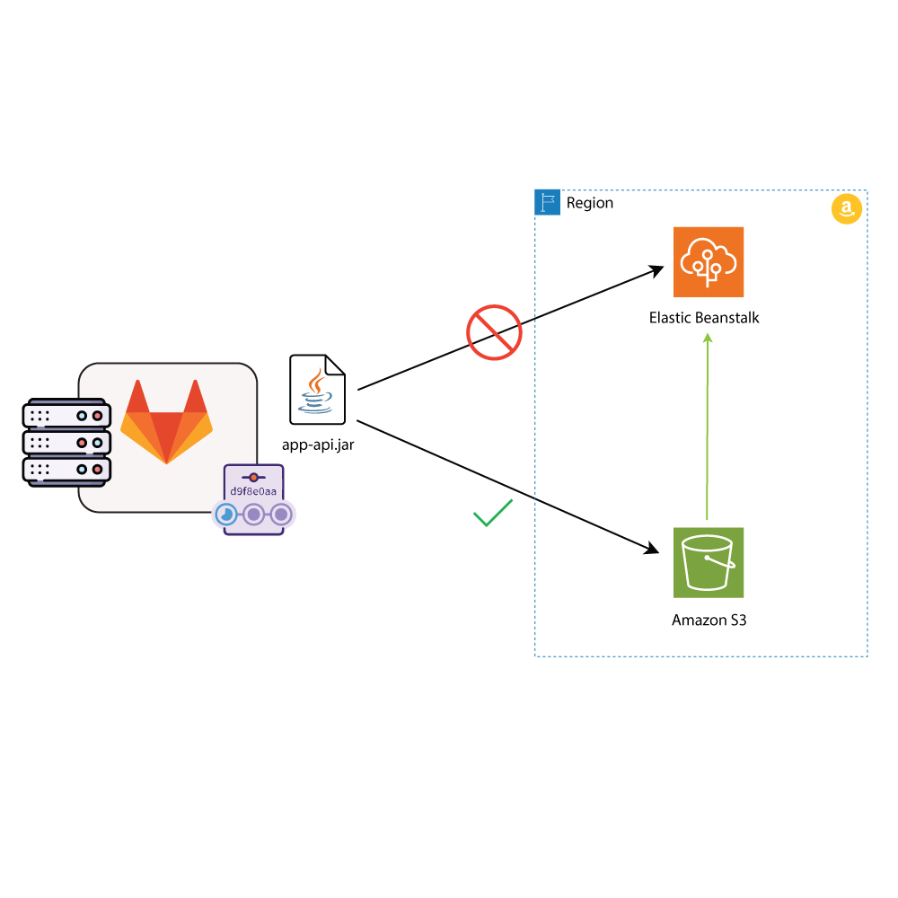

# How to deploy to AWS from GitLab CI

Welcome to this comprehensive guide on deploying your Java applications to AWS cloud infrastructure directly from GitLab CI. In today's fast-paced development environment, automation is key. This guide is designed to help developers streamline their deployment processes, eliminating the need for manual intervention. We will explore how to leverage AWS's powerful tools alongside GitLab CI to achieve seamless deployment workflows. Whether you're new to AWS or looking to integrate your GitLab CI pipeline, this guide will provide you with the necessary steps and best practices to get your Java application running in the cloud efficiently.

## Table of Contents

- [Introduction](#introduction)
- [Understanding AWS Tools for Automation](#understanding-aws-tools-for-automation)
- [Setting Up AWS CLI](#setting-up-aws-cli)
- [Deploying to AWS Elastic Beanstalk via AWS S3](#deploying-to-aws-elastic-beanstalk-via-aws-s3)
- [Configuring GitLab CI for AWS Deployment](#configuring-gitlab-ci-for-aws-deployment)
- [Best Practices](#best-practices)
- [Key Takeaways](#key-takeaways)
- [Conclusion](#conclusion)
- [References](#references)

## Introduction

The goal of this document is to provide a clear and structured guide for deploying Java applications to AWS using GitLab CI. This involves understanding the automation tools provided by AWS, setting up the necessary services, and configuring GitLab CI for a smooth deployment process.

## Understanding AWS Tools for Automation

AWS offers various tools that enable automation for deploying applications. Among these tools, the AWS Command Line Interface (CLI) is pivotal. It allows developers to interact with AWS services directly from the command line, facilitating automated scripts over graphical interfaces.

## Setting Up AWS CLI

To start, ensure the AWS CLI is installed and configured on your machine. The AWS CLI is essential for executing commands that interact with AWS services, such as uploading files to AWS S3 or deploying applications using Elastic Beanstalk.

**Example:** Installing AWS CLI on Ubuntu

```bash
sudo apt-get update
sudo apt-get install awscli
```

## Deploying to AWS Elastic Beanstalk via AWS S3

**Diagram:**



AWS S3, or Simple Storage Service, acts as a repository for your application's artifacts, similar to how Dropbox stores files. First, upload your Java application's JAR file to an S3 bucket using the AWS CLI.

**Example:** Uploading a JAR file to S3

```bash
aws s3 cp my-application.jar s3://mybucket/my-application.jar
```

Next, instruct AWS Elastic Beanstalk to deploy the artifact from S3 to your production environment, ensuring your application is up and running in the cloud.

## Configuring GitLab CI for AWS Deployment

Configuring your GitLab CI pipeline is crucial for automating the deployment process. This involves defining a `.gitlab-ci.yml` file that specifies the steps for building your application, uploading the artifact to S3, and deploying to Elastic Beanstalk.

**Example:** `.gitlab-ci.yml` snippet for AWS deployment

```yaml
deploy_to_aws:
  stage: deploy
  script:
    - aws s3 cp my-application.jar s3://mybucket/my-application.jar
    - aws elasticbeanstalk update-environment --environment-name my-env --version-label my-application
```

## Best Practices

- **Secure your AWS credentials**: Ensure they are not hard-coded in your CI pipeline. Use GitLab CI's variables to store them securely.
- **Monitor your deployments**: Utilize AWS CloudWatch to keep an eye on your application's performance and logs.
- **Automate testing**: Before deploying, automatically run your test suite to catch issues early.

## Key Takeaways

- Automating deployment processes saves time and reduces errors.
- AWS CLI and S3 are essential tools for deploying applications to AWS.
- Properly configuring your GitLab CI pipeline is crucial for seamless deployments.

## Conclusion

Deploying your Java application to AWS using GitLab CI not only optimizes your workflow but also enhances your application's reliability and availability. By following this guide, you're equipped to automate your deployment process, leveraging AWS's robust cloud infrastructure. Remember, the key to successful automation lies in understanding the tools at your disposal and implementing best practices.

## References

- [AWS CLI Official Documentation](https://aws.amazon.com/cli/)
- [AWS Elastic Beanstalk Documentation](https://aws.amazon.com/elasticbeanstalk/)