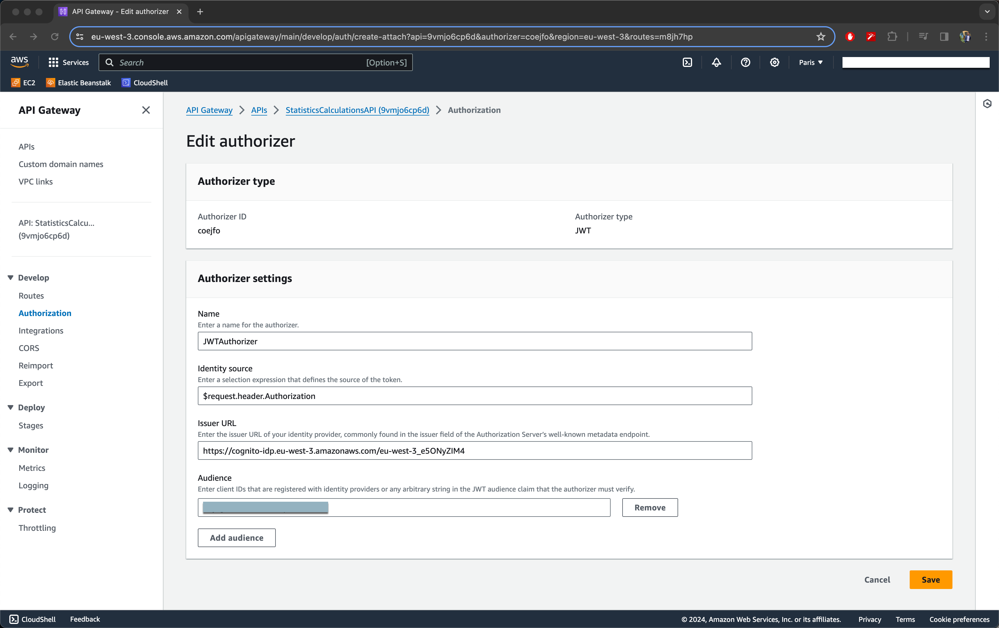
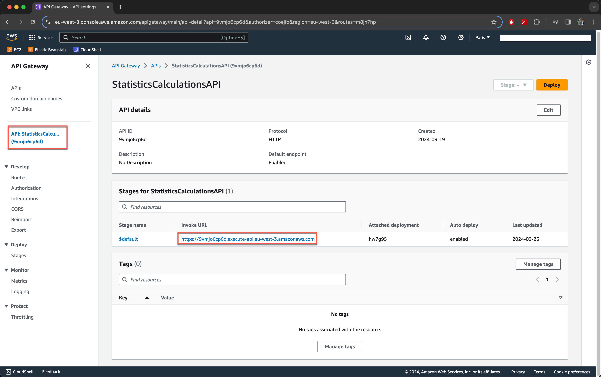

# Securing API Gateway with AWS Cognito

Welcome to this guide on securing your API Gateway using AWS Cognito. Whether you're a developer looking to protect your APIs or a beginner in cloud security, this document will walk you through the essentials of implementing robust security measures with AWS services. By the end of this guide, you'll understand how to integrate AWS Cognito with API Gateway, ensuring secure access to your APIs.

## Table of Contents

- [Introduction](#introduction)
- [Setting up JWT authorizers](#setting-up-jwt-authorizers)
- [Testing Secure Access](#testing-secure-access)
- [Best Practices](#best-practices)
- [Key Takeaways](#key-takeaways)
- [Conclusion](#conclusion)
- [References](#references)

## Introduction

In the digital age, securing APIs has become paramount. AWS Cognito offers robust security features that, when integrated with API Gateway, provide a secure way to manage access to your APIs. This guide will help you understand how to use AWS Cognito to authenticate and authorize users, protecting your API endpoints from unauthorized access.

## Setting up JWT authorizers

Setting up an authorizer is a critical step in securing your API endpoints. When using AWS Cognito for authentication, a JWT authorizer can be used to protect your API by ensuring that only requests with a valid JWT (JSON Web Token) can access it. Below, we'll delve into the details of creating and attaching a JWT authorizer to your API Gateway.

### Step 1: Create and Attach an Authorizer

First, you'll need to create a new authorizer for your API that will use JWT tokens for authorization:

- **Authorizer Type:** Choose JWT as the authorizer type. JWT authorizers allow you to use JSON Web Tokens provided by Cognito (or another issuer) to authenticate requests.

### Step 2: Configure Authorizer Settings

Configure your authorizer with the following settings:

- **Name:** Give your authorizer a name, such as `JWTAuthorizer`, to identify it within your API Gateway configuration.
- **Identity Source:** This is where the authorizer looks for the JWT token in incoming requests. Set this to `$request.header.Authorization` to tell the authorizer to look for the token in the Authorization header of the request.

### Setp 3: Construct the Issuer URL

The Issuer URL is a crucial component for validating the JWT tokens. It tells the authorizer where to find the JSON Web Key Set (JWKS), which is used to validate the signature of the token. To find the Issuer URL for your Cognito User Pool:

1. **Navigate to the Amazon Cognito console** and select your user pool.
2. **Go to the "App integration" section** and click on "Domain name." If you have a domain name set up for your user pool, it will be displayed here.
3. **Construct the Issuer URL** using the following format: 

```
https://cognito-idp.<region>.amazonaws.com/<userPoolId>
```

Replace `<region>` with the AWS region of your Cognito user pool (e.g., `eu-west-3`) and `<userPoolId>` with the ID of your user pool (e.g., `eu-west-3_e5ONyZIM4`).

For the given example, the Issuer URL would be:

```
https://cognito-idp.eu-west-3.amazonaws.com/eu-west-3_e5ONyZIM4
```

### Step 4: Add Audience

The audience (`aud`) claim identifies the recipients that the JWT is intended for. In this context, it is your API that the token is meant to access:

- **Copy Client ID:** Navigate to the "App clients" section in your Cognito User Pool console. Find the app client used by your application and copy the Client ID.
- **Paste in Audience Field:** In the authorizer configuration, paste the copied Client ID into the audience field. This ensures that only tokens intended for your API are considered valid.



## Testing Secure Access

After configuring your API Gateway with AWS Cognito, it's essential to test and verify that the security measures are functioning as expected. This step ensures that your API endpoints are protected and can only be accessed with the proper authorization.

### How to Test:

1. **Invoke Your API:** Use a tool like Postman, curl, or any HTTP client of your choice to make a request to your API's URL. At this stage, intentionally omit the authentication token from the request header. This simulates an unauthorized access attempt.



2. **Expected Response:** If your API Gateway is correctly secured with AWS Cognito, you should receive the following response:

```json
{
    "message": "Unauthorized"
}
```

This response indicates that your API Gateway has successfully blocked access to an unauthorized request, confirming that your security integration with AWS Cognito is working correctly.

### Understanding the Response:

- **Unauthorized Message:** Receiving an "Unauthorized" message in response to a request without a valid JWT token is a positive indication that your API endpoints are secure. It means that AWS Cognito and API Gateway are correctly configured to require proper authentication before granting access.

## Best Practices

- **Regularly Update Security Settings:** Keep your AWS Cognito and API Gateway configurations up to date with the latest security practices.
- **Monitor API Activity:** Use AWS CloudWatch to monitor API activity and detect unauthorized access attempts.

## Key Takeaways

- **AWS Cognito Integration:** AWS Cognito provides a robust solution for managing user authentication and authorization. Integrating it with API Gateway ensures that only authenticated users can access your API endpoints, leveraging JWT tokens for secure access control.

- **Configuring API Gateway Authorizer:** A JWT authorizer is used to secure API endpoints. Key configurations include:
    - **Authorizer Type:** JWT.
    - **Identity Source:** `$request.header.Authorization` to specify where the JWT token will be found in the incoming request.
    - **Issuer URL:** Constructed from the Cognito domain, it’s crucial for validating JWT tokens. The format is `https://cognito-idp.<region>.amazonaws.com/<userPoolId>`.
    - **Audience:** The app client ID from Cognito, indicating who the JWT token is intended for.

## Conclusion

Securing your API with AWS Cognito and API Gateway not only protects your data but also provides a scalable and manageable approach to securing web and mobile applications. By following this guide, you've taken a significant step towards implementing best-in-class security practices for your APIs.

## References

- [AWS Cognito Documentation](https://docs.aws.amazon.com/cognito/)
- [AWS API Gateway Documentation](https://docs.aws.amazon.com/apigateway/)
- [Controlling access to HTTP APIs with JWT authorizers](https://docs.aws.amazon.com/apigateway/latest/developerguide/http-api-jwt-authorizer.html)