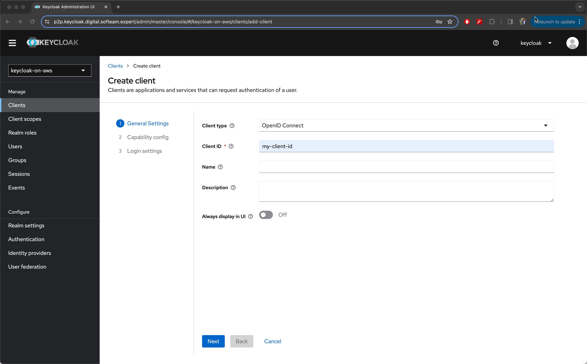
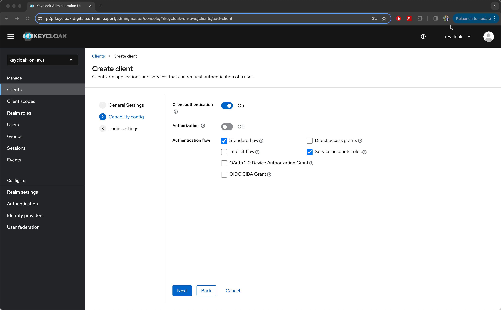
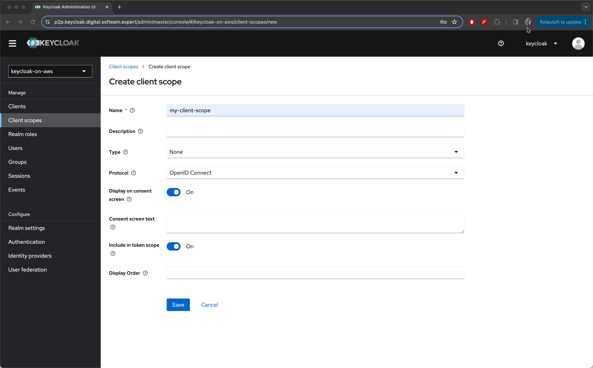
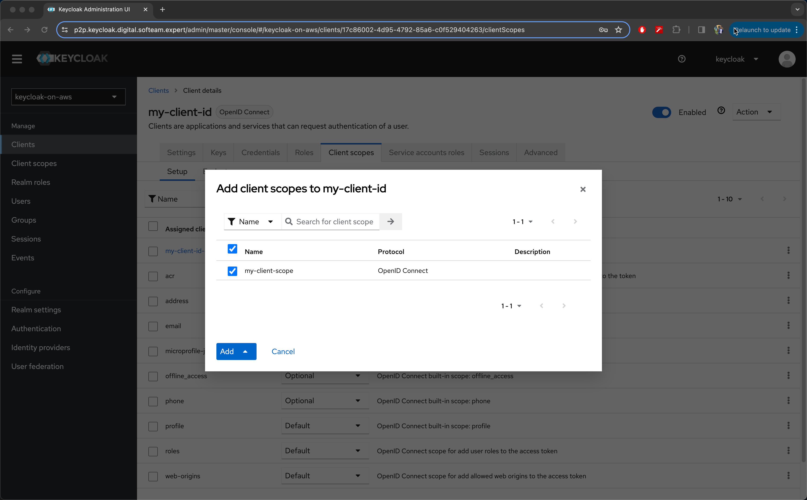
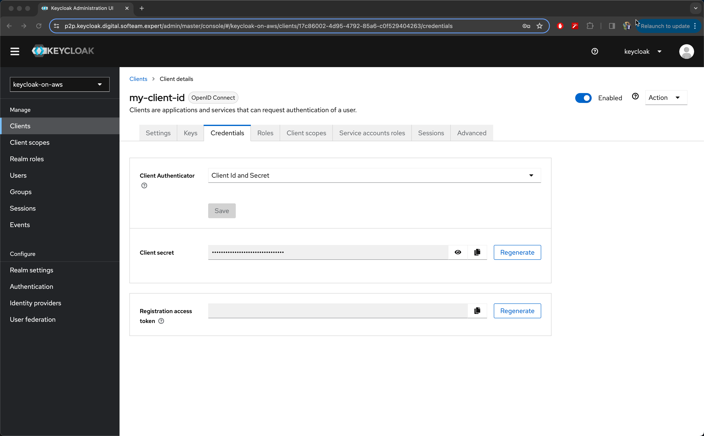

# Setting up Keycloak

Welcome to this comprehensive guide on integrating Keycloak with AWS API Gateway! This document is designed to help you securely manage access to your APIs using Keycloak, an open-source Identity and Access Management solution. Whether you're new to Keycloak or looking to expand its capabilities to secure your APIs, this guide is structured to provide clear, easy-to-understand instructions and examples. Let's embark on this journey together to enhance the security of your API architecture.

## Table of Contents

- [Introduction](#introduction)
- [Prerequisites](#prerequisites)
- [Configure Keycloak](#configure-keycloak)
- [Best Practices](#best-practices)
- [Key Takeaways](#key-takeaways)
- [Conclusion](#conclusion)
- [References](#references)

## Introduction

Setting up Keycloak with an API Gateway, such as AWS API Gateway, is a strategic approach to securing API access. This guide assumes you already have Keycloak running on ECS Fargate and focuses on the steps necessary to integrate it with an API Gateway. By utilizing OAuth 2.0 or OpenID Connect (OIDC), you can ensure secure and efficient management of authentication and authorization processes for your APIs.

## Prerequisites

Before diving into the configuration process, ensure you have the following prerequisites:

1. **Keycloak Running on ECS Fargate:** Your Keycloak instance should be deployed on Amazon ECS Fargate and accessible via a network.
2. **AWS Account:** Required for setting up API Gateway and managing resources.
3. **Domain Name (Optional):** Consider setting up custom domain names for a more polished setup.

## Configure Keycloak

Follow these steps to configure Keycloak for your API Gateway:

### Create a Realm

A realm is a management space in Keycloak for handling users, credentials, and permissions.

- **Action:** Log into the Keycloak admin console, click on the dropdown at the top-left corner, and select "Add realm".
- **Example:** Name the new realm `keycloak-on-aws`.

### Define a Client

Clients in Keycloak are entities that can request authentication and authorization.

#### General Settings

1. **Client ID:** Start by providing a unique identifier for your client. This is how your client will be recognized by Keycloak.
    - **Example Value:** `my-client-id`

2. **Client Protocol:** Specify the protocol that your client will use for authentication.
    - **Select:** `openid-connect` - This choice enables the use of OpenID Connect (OIDC), a robust layer on top of the standard OAuth 2.0 protocol, designed specifically for authentication.

#### Capability Config

Configure the capabilities to define how your client will authenticate and what authorization flows it will support.

1. **Enable Client Authentication:** This setting allows your client to authenticate itself to the Keycloak server.

2. **Authorization:** Set this option to `Off` to disable Keycloak's built-in authorization services for this client, assuming you'll manage authorization within your application or another system.

3. **Authentication Flow:** Configure which OAuth 2.0 or OpenID Connect flows your client can use:
    - **Standard Flow:** Check this option to enable the Authorization Code Flow. This flow is ideal for clients that can securely store credentials and is commonly used for server-side applications. It provides a way to exchange an authorization code for a token.
    - **Service Accounts Roles:** Enable this to allow your client to authenticate directly with Keycloak without user interaction and obtain access tokens. This is known as the Client Credentials Grant and is suited for server-to-server communication where the client acts on its own behalf.

#### Login Settings

For the login settings, you can leave the default values as is. These settings typically involve configuring how users will log into your client, but for API clients, the default settings are often adequate.

- **Action:** After configuring the above settings, click on **"Save"** to finalize the creation and configuration of your client.

### Manage Client Scopes

Client scopes in Keycloak are used to define and manage permissions and access levels for your clients. This section is divided into two steps to guide you through the process of creating and then adding these scopes to your client.

#### Create Client Scopes

1. **Navigation:** In the Keycloak admin console, locate and select the "Client scopes" menu option.
2. **Create Scope:** Click on the "Create client scope" button to initiate the creation of a new scope.
3. **Name the Scope:** Assign a name to your new client scope for easy identification.
   - **Example Name:** `my-client-scope`
4. **Save:** Complete the creation process by saving the new scope. This action establishes a new client scope within Keycloak, which can then be assigned to different clients to manage their permissions systematically.

#### Add Client Scopes to Your Client

Once you have created a client scope, the next step is to associate it with your client. This enables the client to use the permissions and access levels defined within the scope.

1. **Select Your Client:** Return to the "Clients" section of the admin console and choose the client you're configuring. For this guide, you would select `my-client-id`.
2. **Client Scopes Tab:** Within your client's settings, find and click on the "Client Scopes" tab to view the scopes available for association.
3. **Add Client Scope:** Look for the "Add client scope" option. Click it, then select the `my-client-scope` you previously created from the list of available scopes.
4. **Associate Scope:** Finalize the association by adding the selected client scope to your client. This step effectively applies the permissions and access rules defined in `my-client-scope` to your client, thereby controlling its access to various resources and actions within Keycloak.

### Retrieve Keycloak Endpoint and Credentials

Important for integrating with the API Gateway.

- **Keycloak Auth URL:** Note the URL format `https://<keycloak-url>/auth/realms/<realm-name>`.
- **Client Secret:** Available under the "Credentials" tab of your client settings.

## Best Practices

- **Security:** Regularly update Keycloak and AWS configurations to adhere to the latest security standards.
- **Management:** Use roles and permissions effectively to manage access control.
- **Documentation:** Keep documentation of configurations and changes for troubleshooting and compliance.

## Key Takeaways

- This setup enables robust security for your APIs through OAuth 2.0 and OIDC.
- Proper configuration and management of Keycloak can significantly enhance your API security posture.
- Continuous learning and adaptation to new security practices are essential.

## Conclusion

By following this guide, you've taken a significant step towards securing your APIs with Keycloak and AWS API Gateway. The integration not only enhances security but also provides a scalable way to manage authentication and authorization across your services. Remember, the journey to secure your APIs is ongoing, and staying informed about best practices and updates in Keycloak and AWS is crucial.

## References

- [Keycloak - Creating a client application](https://www.keycloak.org/docs/latest/authorization_services/index.html#_resource_server_create_client)
- [Keycloak - Token endpoint](https://www.keycloak.org/docs/latest/securing_apps/index.html#token-endpoint)
- [Keycloak - How token exchange works](https://www.keycloak.org/docs/latest/securing_apps/#_token-exchange)
- [OAuth 2.0 Token Exchange](https://datatracker.ietf.org/doc/html/rfc8693)
- [The OAuth 2.0 Authorization Framework](https://datatracker.ietf.org/doc/html/rfc6749#section-4.4)
- [OpenID Connect Core 1.0](https://openid.net/specs/openid-connect-core-1_0.html#AuthorizationEndpoint)