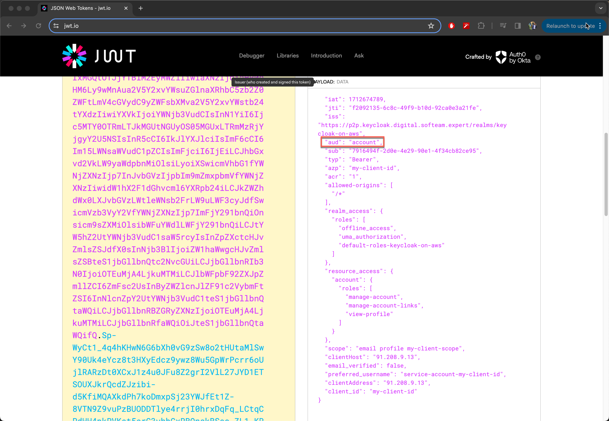
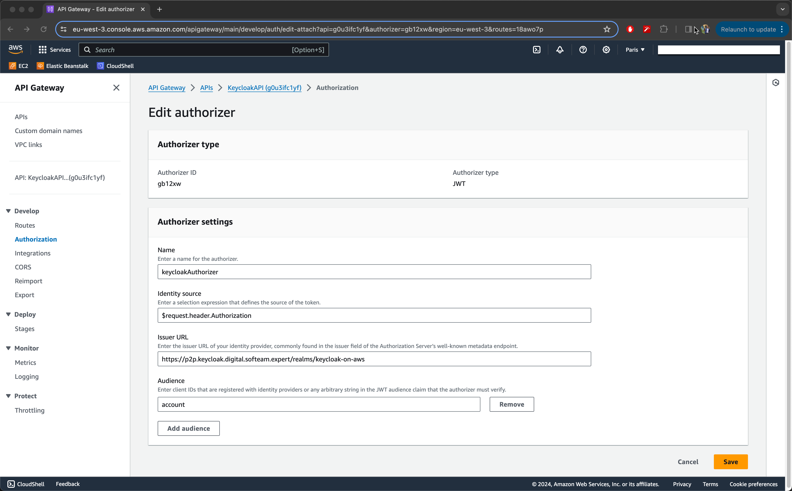
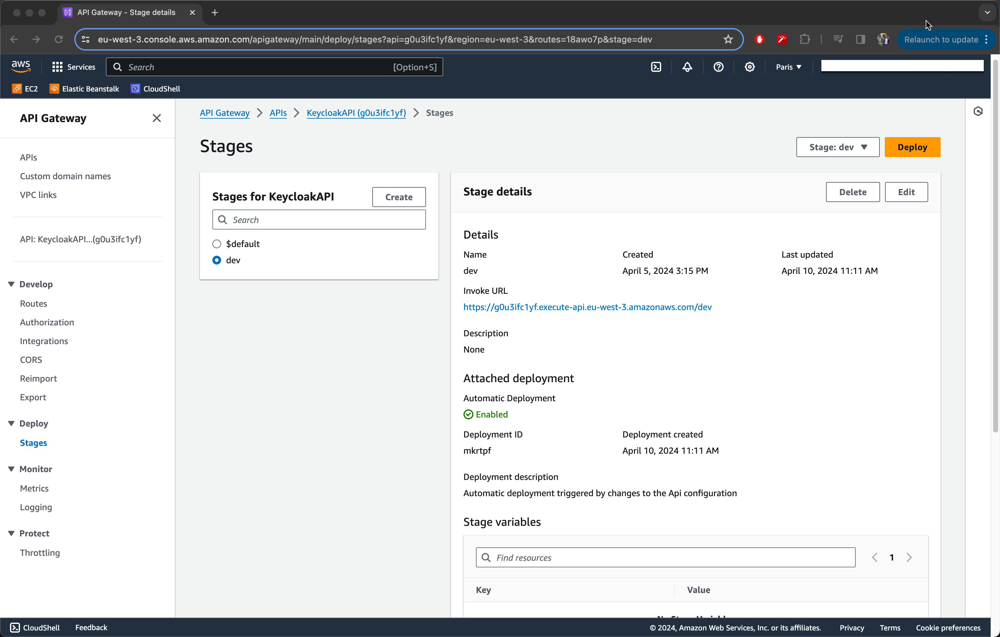
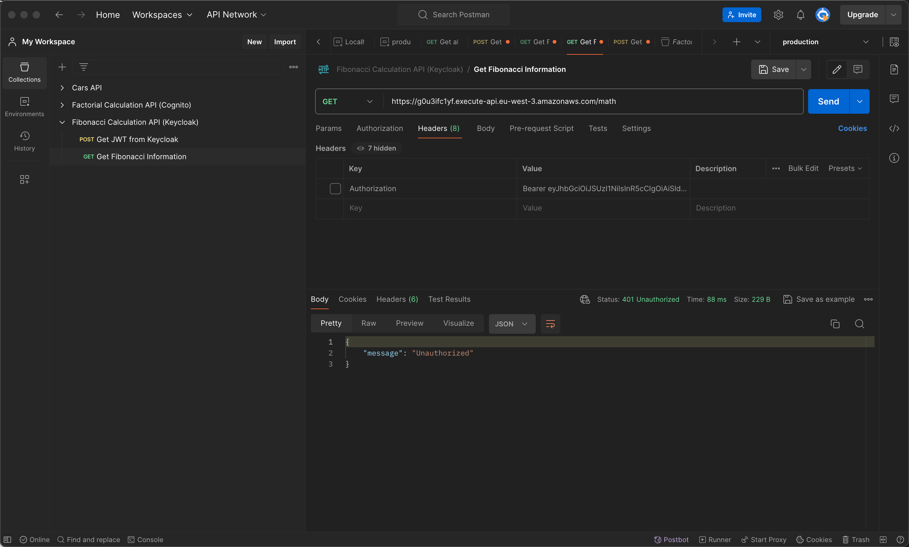

# Securing API Gateway with Keycloak

Welcome to this guide on securing your API Gateway using Keycloak. Whether you're a developer looking to protect your APIs or a beginner in cloud security, this document will walk you through the essentials of implementing robust security measures. By the end of this guide, you'll understand how to integrate Keycloak with API Gateway, ensuring secure access to your APIs.

## Table of Contents

- [Introduction](#introduction)
- [Setting up JWT authorizers](#setting-up-jwt-authorizers)
- [Testing Secure Access](#testing-secure-access)
- [Best Practices](#best-practices)
- [Key Takeaways](#key-takeaways)
- [Conclusion](#conclusion)
- [References](#references)

## Introduction

In the digital age, securing APIs has become paramount. Keycloak offers robust security features that, when integrated with API Gateway, provide a secure way to manage access to your APIs. This guide will help you understand how to use Keycloak to authenticate and authorize users, protecting your API endpoints from unauthorized access.

## Setting up JWT authorizers

Setting up an authorizer is a critical step in securing your API endpoints. When using Keycloak for authentication, a JWT authorizer can be used to protect your API by ensuring that only requests with a valid JWT (JSON Web Token) can access it. Below, we'll delve into the details of creating and attaching a JWT authorizer to your API Gateway.

### Step 1: Create and Attach an Authorizer

First, you'll need to create a new authorizer for your API that will use JWT tokens for authorization:

- **Authorizer Type:** Choose JWT as the authorizer type. JWT authorizers allow you to use JSON Web Tokens provided by Keycloak (or another issuer) to authenticate requests.

### Step 2: Configure Authorizer Settings

Configure your authorizer with the following settings:

- **Name:** Give your authorizer a name, such as `JWTAuthorizer`, to identify it within your API Gateway configuration.
- **Identity Source:** This is where the authorizer looks for the JWT token in incoming requests. Set this to `$request.header.Authorization` to tell the authorizer to look for the token in the Authorization header of the request.

### Step 3: Construct the Issuer URL

The Issuer URL is a crucial component for validating the JWT tokens. It tells the authorizer where to find the JSON Web Key Set (JWKS), which is used to validate the signature of the token. To find the Issuer URL for your Keycloak Realm:

1. **Navigate to the Keycloak admin console** and select your realm.
2. **Go to the "Realm Settings" section** and click on "Keys."
3. **Construct the Issuer URL** using the following format: 

```
https://<keycloak-server>/realms/<realm-name>
```

Replace `<keycloak-server>` with the URL of your Keycloak server (e.g., `keycloak.example.com`) and `<realm-name>` with the name of your realm (e.g., `myrealm`).

For the given example, the Issuer URL would be:

```
https://keycloak.example.com/realms/myrealm
```

### Step 4: Add Audience

The audience (`aud`) claim in a JWT specifies its intended recipients, typically your API or service that validates the token. This step is crucial for ensuring that tokens are only used by their intended audience, enhancing security.

#### Understand the Audience clain in a Token

A JWT (a type of secure token) has something called an `aud` (audience) claim. Think of the `aud` claim as a label that says "this token is for use by this specific service or API." 

Here's why it's important:

- **Who It's For**: The `aud` claim tells us which service or API the token is supposed to be used with. If you have an API, the `aud` claim would include something that identifies it, like its name or web address. 

- **Checking the Label**: When your API gets this token, it looks at the `aud` claim to see if it matches its own identifier. If they match, it means the token was meant for this API.

- **Keeping Things Secure**: This check is a way to keep things secure. It makes sure that tokens meant for one service can't be wrongly used to access another. It's like making sure a key only opens the door it's supposed to.

- **Making Sure Tokens Stay With Their Intended Audience**: In simple terms, the `aud` claim helps ensure that only the right service or API can use the token, which helps keep everything secure and in order.

#### Identifying the Audience in a Token

- **Decoding the Token**: The audience field can be found within the decoded JWT. Tools or libraries that decode JWTs will reveal the `aud` claim among others, showing you the intended audience of the token. This is useful for verifying that the token is meant for your application or service.



- **Understanding Default Audience**: By default, Keycloak assigns the `aud` claim the value `account`, pointing to Keycloak's own account management service. This is generally for internal use within Keycloak and may not be suitable for external APIs or services that require specific identification.

#### Configuring the Audience for Your API

- **Using the Default Audience**: For simplicity in demonstrations or certain configurations, you might use the default `account` value as the audience. This approach simplifies setup but is generally not recommended for production environments targeting specific external APIs or services.
  
- **Specifying the Audience in Your Application**: When configuring your authorizer or application to validate JWTs, specify the `account` in the audience validation field if you are using the default Keycloak audience. This tells your application to accept tokens intended for Keycloak's account service, suitable for demos or internal applications linked closely with Keycloak's user management features.



## Testing Secure Access

After configuring your API Gateway with Keycloak, it's essential to test and verify that the security measures are functioning as expected. This step ensures that your API endpoints are protected and can only be accessed with the proper authorization.

### Finding Your API's Base URL in API Gateway

To effectively invoke your API, you'll need to know its base URL, which is the starting point of your API's address on the web. Here's how you can locate the base URL of your API in AWS API Gateway:

1. **Open AWS Management Console**: Log in to the AWS Management Console and navigate to the API Gateway service.

2. **Select Your API**: From the list of available APIs, select the one you've configured with Keycloak for security.

3. **API Dashboard**: Once you've selected your API, you'll be directed to its dashboard. Here, you can find various details about your API, including its resources, methods, stages, and more.

4. **Find the Base URL**:
    - **Stages**: Look for the "Stages" option in the left navigation panel of the API Gateway dashboard. Click on it to view the different deployment stages of your API (e.g., `dev`, `test`, `prod`).
    - **Stage Details**: Select the stage that you're working with or interested in. Each stage represents a different deployment of your API, potentially with different configurations or versions.
    - **Invoke URL**: Within the stage details, you will find the "Invoke URL" section at the top. This URL is the base URL for your API at the selected stage. It typically looks something like `https://<api-id>.execute-api.<region>.amazonaws.com/<stage>`, where `<api-id>` is your API's unique identifier, `<region>` is the AWS region where your API is deployed, and `<stage>` is the stage name.

5. **Combine Base URL with Resource Path**: To invoke a specific endpoint of your API, append the resource path (e.g., `/math`) to the base URL found in the stage details. This forms the full URL for making requests to that endpoint.



### Testing Your API using Postman

1. **Invoke Your API with Resource Path**: Use a tool like Postman, curl, or any HTTP client of your choice to make a request to your API's URL, appending the resource path `/math` to the base URL. For example, if your base URL is `https://api.example.com`, you should make requests to `https://api.example.com/math`. Omit the authentication token from the request header to simulate an unauthorized access attempt.



2. **Expected Response**: With the correct setup and the inclusion of the resource path in your request, if your API Gateway is securely configured with Keycloak, the response to an unauthorized request should be:

```json
{
    "message": "Unauthorized"
}
```

This response indicates that your API Gateway has successfully blocked access to an unauthorized request, confirming that your security integration with Keycloak is working correctly.

## Best Practices

- **Regularly Update Security Settings:** Keep your Keycloak and API Gateway configurations up to date with the latest security practices.
- **Monitor API Activity:** Use AWS CloudWatch to monitor API activity and detect unauthorized access attempts.

## Key Takeaways

- **Keycloak Integration:** Keycloak provides a robust solution for managing user authentication and authorization. Integrating it with API Gateway ensures that only authenticated users can access your API endpoints, leveraging JWT tokens for secure access control.

- **Configuring API Gateway Authorizer:** A JWT authorizer is used to secure API endpoints. Key configurations include:
    - **Authorizer Type:** JWT.
    - **Identity Source:** `$request.header.Authorization` to specify where the JWT token will be found in the incoming request.
    - **Issuer URL:** Constructed from the Keycloak domain, it’s crucial for validating JWT tokens. The format is `https://<keycloak-server>/realms/<realm-name>`.
    - **Audience:** The client ID from Keycloak, indicating who the JWT token is intended for.

## Conclusion

Securing your API with Keycloak and API Gateway not only protects your data but also provides a scalable and manageable approach to securing web and mobile applications. By following this guide, you've taken a significant step towards implementing best-in-class security practices for your APIs.

## References

- [Keycloak Documentation](https://www.keycloak.org/docs/latest/)
- [AWS API Gateway Documentation](https://docs.aws.amazon.com/apigateway/)
- [Controlling access to HTTP APIs with JWT authorizers](https://docs.aws.amazon.com/apigateway/latest/developerguide/http-api-jwt-authorizer.html)
- [How to create a Keycloak client with an audience mapper](https://www.youtube.com/watch?v=G2QVhUAEylc&ab_channel=AlexEllis)