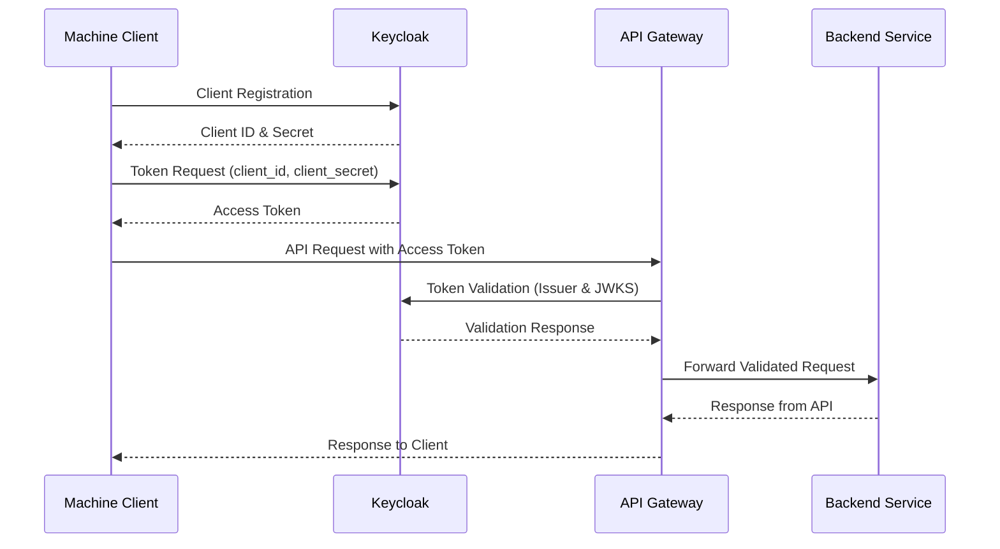

# Lambda Development with API Gateway and Keycloak

Welcome to the Lambda Development with API Gateway and Keycloak guide! This document provides a comprehensive overview of integrating Keycloak with AWS Lambda and API Gateway to secure your APIs using OAuth2.0 and OpenID Connect (OIDC) tokens. Whether you are a beginner or an experienced developer, this guide will help you understand the essential steps and best practices for implementing secure API access.

## Table of Contents

- [Introduction](#introduction)
- [Sub-directories Overview](#sub-directories-overview)
    - [Creating ACM Certificate](#creating-acm-certificate)
    - [Deploying Keycloak on AWS using CloudFormation](#deploying-keycloak-on-aws-using-cloudformation)
    - [Creating a Record in Route 53 for Resolving the Domain Name](#creating-a-record-in-route-53-for-resolving-the-domain-name)
    - [Setting up AWS Lambda](#setting-up-aws-lambda)
    - [Setting up API Gateway](#setting-up-api-gateway)
    - [Setting up Keycloak](#setting-up-keycloak)
    - [Securing API Gateway with Keycloak](#securing-api-gateway-with-keycloak)
    - [Getting JSON Web Tokens from Keycloak using Postman](#getting-json-web-tokens-from-keycloak-using-postman)
    - [Calling API Gateway using JSON Web Tokens](#calling-api-gateway-using-json-web-tokens)
- [Client Authentication and Token Retrieval](#client-authentication-and-token-retrieval)
    - [Step 1: Client Registration](#step-1-client-registration)
    - [Step 2: Request Token](#step-2-request-token)
    - [Step 3: Token Issuance](#step-3-token-issuance)
- [Accessing the API Gateway](#accessing-the-api-gateway)
    - [Step 4: API Request with Token](#step-4-api-request-with-token)
- [API Gateway Authorization](#api-gateway-authorization)
    - [Step 5: Token Validation](#step-5-token-validation)
- [Accessing the Protected Resource](#accessing-the-protected-resource)
    - [Step 6: Forward Request](#step-6-forward-request)
    - [Step 7: Response from API](#step-7-response-from-api)
    - [Step 8: Response to Client](#step-8-response-to-client)
- [Sequence Diagram of the Flow](#sequence-diagram-of-the-flow)
- [Summary of the Flow Steps](#summary-of-the-flow-steps)
- [Best Practices](#best-practices)
- [Conclusion](#conclusion)
- [References](#references)

## Introduction

In this guide, you will learn how to secure your AWS Lambda APIs using Keycloak for authentication and API Gateway for authorization. The integration of these technologies allows for robust security, ensuring that only authenticated and authorized clients can access your APIs. We will cover client registration, token retrieval, API requests, and token validation.

## Sub-directories Overview

This course is organized into several sub-directories to break down the tutorial into manageable sections. Follow these steps in order to complete the setup:

### [Creating ACM Certificate](./01-creating-acm-certificate/README.md)

In this guide, you will learn how to create an ACM certificate to secure your API Gateway with HTTPS.

### [Deploying Keycloak on AWS using CloudFormation](./02-deploying-keycloak-on-aws-using-cloudformation/README.md)

Learn how to deploy Keycloak on AWS using CloudFormation templates to automate the setup process.

### [Creating a Record in Route 53 for Resolving the Domain Name](./03-creating-a-record-in-route-53-for-resolving-the-domain-name/README.md)

Set up a DNS record in Route 53 to resolve your domain name, ensuring your services are accessible via a user-friendly URL.

### [Setting up AWS Lambda](./03-creating-a-record-in-route-53-for-resolving-the-domain-name/README.md)

Instructions for setting up AWS Lambda functions that will act as your backend services.

### [Setting up API Gateway](./05-setting-up-api-gateway/README.md)

Guide to setting up API Gateway to handle incoming requests and route them to your Lambda functions.

### [Setting up Keycloak](./06-setting-up-keycloak/README.md)

Step-by-step guide to setting up Keycloak, configuring realms, clients, and roles.

### [Securing API Gateway with Keycloak](./07-securing-api-gateway-with-keycloak/README.md)

Learn how to secure your API Gateway using Keycloak by configuring token validation and authorization.

### [Getting JSON Web Tokens from Keycloak using Postman](./08-getting-json-web-tokens-from-keycloak-using-postman/README.md)

Tutorial on using Postman to retrieve JSON Web Tokens (JWT) from Keycloak for API requests.

### [Calling API Gateway using JSON Web Tokens](./09-calling-api-gateway-using-json-web-tokens/README.md)

Learn how to call your secured API Gateway using JWTs obtained from Keycloak.

## Client Authentication and Token Retrieval

In this section, we will walk through the process of authenticating a machine client with Keycloak and retrieving an access token. This token is essential for accessing protected resources through the API Gateway. You will learn how to register a client in Keycloak, request an access token using client credentials, and understand the issuance process. This foundational step ensures that your machine client can securely interact with your API services.

### Step 1: Client Registration

First, register your machine client in Keycloak as a confidential client. During this process, Keycloak will generate a client ID and client secret for your application.

### Step 2: Request Token

The machine client requests an access token from Keycloak by authenticating itself using the client ID and client secret. This is done by making a POST request to the token endpoint:

```bash
POST /realms/{realm-name}/protocol/openid-connect/token
Host: {keycloak-server-url}
Content-Type: application/x-www-form-urlencoded

grant_type=client_credentials
&client_id={client-id}
&client_secret={client-secret}
```

### Step 3: Token Issuance

Keycloak verifies the client credentials. Upon successful verification, Keycloak issues an access token (JWT).

## Accessing the API Gateway

In this section, we will cover how to make API requests to the API Gateway using the access tokens obtained from Keycloak. This step involves including the token in the authorization header of your HTTP requests. By doing so, you ensure that your requests are authenticated and can be validated by the API Gateway before reaching the backend services.

### Step 4: API Request with Token

The machine client includes the access token in the Authorization header of the HTTP request to the API Gateway:

```bash
GET /api/resource
Host: {api-gateway-url}
Authorization: Bearer {access-token}
```

## API Gateway Authorization

In this section, we will discuss how the API Gateway authorizes incoming requests using the access tokens issued by Keycloak. This involves validating the token to ensure it is legitimate, has not expired, and contains the necessary claims. By configuring API Gateway to handle token validation, you can enforce strict access control to your backend services, ensuring that only authenticated and authorized requests are processed. This step is crucial for maintaining the security and integrity of your API infrastructure.

### Step 5: Token Validation

The API Gateway receives the request and extracts the access token from the Authorization header. It then validates the token by checking the signature, expiration, issuer, audience, and other claims. The API Gateway uses the Issuer URL and JWKS URL from Keycloak to perform these validations.

- **Issuer URL**: 

```
https://{keycloak-server-url}/realms/{realm-name}
```

- **JWKS URL**:

```
https://{keycloak-server-url}/realms/{realm-name}/protocol/openid-connect/certs
```

## Accessing the Protected Resource

In this section, we will explain how the API Gateway forwards validated requests to the backend services and how these services respond to the client. 

### Step 6: Forward Request

If the token is valid, the API Gateway forwards the request to the appropriate backend service or API.

### Step 7: Response from API

The backend service processes the request and sends the response back to the API Gateway.

### Step 8: Response to Client

The API Gateway forwards the response from the backend service to the machine client.

## Sequence Diagram of the Flow

In this section, we present a sequence diagram that visually represents the flow of interactions between the machine client, Keycloak, API Gateway, and the backend service. This diagram will help you understand the step-by-step process of client authentication, token validation, and API request handling, providing a clear overview of how these components work together to secure your APIs.



## Summary of the Flow Steps

1. **Client Registration**: Machine client is registered in Keycloak.
2. **Token Request**: Machine client requests an access token using client credentials.
3. **Token Issuance**: Keycloak issues an access token.
4. **API Request**: Machine client sends a request to the API Gateway with the access token.
5. **Token Validation**: API Gateway validates the access token using Keycloak's issuer and JWKS endpoints.
6. **Forward Request**: Validated request is forwarded to the backend service.
7. **Response from API**: Backend service processes the request and responds.
8. **Response to Client**: API Gateway forwards the response back to the machine client.

## Best Practices

- **Secure Storage**: Store client credentials securely, avoiding hardcoding them in your application.
- **Token Expiration**: Implement token refresh mechanisms to handle expired tokens gracefully.
- **Error Handling**: Handle authentication and authorization errors appropriately to ensure a good user experience.
- **Logging and Monitoring**: Enable logging and monitoring on your API Gateway and backend services for better observability and troubleshooting.
- **Least Privilege**: Follow the principle of least privilege when configuring client roles and permissions in Keycloak.

## Conclusion

Integrating Keycloak with AWS Lambda and API Gateway provides a robust solution for securing your APIs. By following the steps outlined in this guide, you can ensure that only authenticated and authorized clients can access your services, enhancing the security of your applications.

## References

- [Keycloak Documentation](https://www.keycloak.org/documentation)
- [AWS API Gateway Documentation](https://docs.aws.amazon.com/apigateway/latest/developerguide/welcome.html)
- [AWS Lambda Documentation](https://docs.aws.amazon.com/lambda/latest/dg/welcome.html)
- [The OAuth 2.0 Authorization Framework on RFC Editor website](https://www.rfc-editor.org/rfc/rfc6749#section-3.2)
- [The OAuth 2.0 Authorization Framework on Data Tracker website](https://datatracker.ietf.org/doc/html/rfc6749#section-3.2)
- [Approaches for authenticating external applications in a machine-to-machine scenario](https://aws.amazon.com/fr/blogs/security/approaches-for-authenticating-external-applications-in-a-machine-to-machine-scenario/)