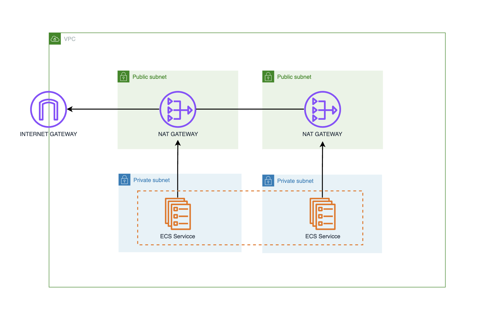

# Creating a Large Sized AWS VPC for an Amazon ECS Cluster

## Table of Contents

- [Introduction](#introduction)
- [Concepts](#concepts)
- [Key Features](#key-features)
- [Prerequisites](#prerequisites)
- [Architecture](#architecture)
- [Subnet Compatibility](#subnet-compatibility)
- [AWS CLI Configuration](#aws-cli-configuration)
- [VPC Configuration](#vpc-configuration)
- [Working with CloudFormation](#working-with-cloudformation)
- [Best Practices](#best-practices)
- [Key Takeaways](#key-takeaways)
- [Conclusion](#conclusion)
- [References](#references)

## Introduction

Welcome to the comprehensive guide for creating a large AWS Virtual Private Cloud (VPC) tailored for an Amazon ECS (Elastic Container Service) cluster. This document provides step-by-step instructions for deploying a reusable CloudFormation pattern to create a VPC capable of hosting thousands of container tasks with internet access. Whether you are a beginner or an experienced AWS user, this guide will help you configure a robust and scalable VPC for your containerized applications.

## Concepts

The Amazon Virtual Private Cloud (Amazon VPC) gives you full control over your virtual networking environment, including resource placement, connectivity, and security. For container tasks within an Amazon ECS cluster, using VPC networking mode is recommended. This mode provides each task with a unique private IP address in your VPC, allowing for granular control over container-to-container communication, even when tasks are running on the same EC2 instance. This guide will help you create a large VPC that can support tens of thousands of containers, complete with NAT gateways for internet access.

## Key Features

- Full control over virtual networking environment.
- Granular security control using VPC security groups.
- Support for large-scale container deployments.
- Internet access for containerized tasks through NAT gateways.

## Prerequisites

Before you begin, ensure you have the following prerequisites in place:

1. **AWS Account:** You need an active AWS account. If you don't have one, you can create it [here](https://aws.amazon.com/free/).
2. **AWS CLI:** Install and configure the AWS Command Line Interface (CLI). Instructions can be found [here](https://docs.aws.amazon.com/cli/latest/userguide/install-cliv2.html).
3. **CloudFormation Template:** Ensure you have the CloudFormation template (`vpc.yml`) ready. You can either create your own or use the template provided in this guide.
4. **IAM Permissions:** Ensure you have the necessary IAM permissions to create and manage VPCs, subnets, NAT gateways, and CloudFormation stacks.
5. **Text Editor:** Use a text editor of your choice to edit any configuration files if necessary. Popular options include VS Code, Sublime Text, or Atom.
6. **Basic Understanding of VPC Concepts:** Familiarity with VPC, subnets, NAT gateways, and ECS concepts will be helpful.

## Architecture

The architecture of the large VPC for an Amazon ECS cluster includes the following components:



- **Two Availability Zones:** Ensures high availability by spanning the VPC across two AZs.
- **Public and Private Subnets:** Each AZ contains both public and private subnets.
- **Internet Gateway:** Provides internet access to resources in the public subnets.
- **NAT Gateways:** Enable internet access for resources in the private subnets.

## Subnet Compatibility

This table shows the compatibility of different subnet configurations for internet access and networking modes within an AWS VPC, specifically for Amazon ECS tasks. Each configuration represents a different networking mode used by ECS tasks and whether it is supported in private or public subnets.

| Configuration   | Private Subnets  | Public Subnets                       |
|-----------------|------------------|--------------------------------------|
| EC2 Bridge Mode | ✅               | ✅                                   |
| EC2 Host Mode   | ✅               | ✅                                   |
| EC2 AWS VPC     | ✅               | ❌ (EC2 tasks don't have public IPs) |
| Fargate AWS VPC | ✅               | ❗ (requires assigning public IP)    |

### Configuration Details

1. **EC2 Bridge Mode**

- **Private Subnets**: Supported. Tasks can be deployed in private subnets.
- **Public Subnets**: Supported. Tasks can also be deployed in public subnets.
- **Description**: In Bridge mode, each ECS task shares the network namespace of the host EC2 instance, allowing tasks to communicate using the instance's network settings.

2. **EC2 Host Mode**

- **Private Subnets**: Supported. Tasks can be deployed in private subnets.
- **Public Subnets**: Supported. Tasks can also be deployed in public subnets.
- **Description**: In Host mode, tasks use the network configuration of the host EC2 instance, allowing them to communicate directly with the network interfaces of the instance.

3. **EC2 AWS VPC Mode**

- **Private Subnets**: Supported. Tasks can be deployed in private subnets.
- **Public Subnets**: Not supported. Tasks cannot be deployed in public subnets as they do not get public IPs.
- **Description**: In AWS VPC mode for EC2 instances, each ECS task receives its own elastic network interface (ENI) with a private IP address. This mode does not support public subnets because tasks don't receive public IP addresses, preventing them from accessing the internet directly through an internet gateway.

4. **Fargate AWS VPC Mode**

- **Private Subnets**: Supported. Tasks can be deployed in private subnets.
- **Public Subnets**: Supported, with conditions. Tasks require assigning a public IP to access the internet.
- **Description**: In AWS VPC mode for Fargate, each task receives its own ENI. Tasks in public subnets must have a public IP assigned to them to access the internet. Without a public IP, tasks will not have outbound internet connectivity even if placed in a public subnet.

### Important Notes

- **EC2 AWS VPC Mode:** Tasks cannot be placed in public subnets as they only have private IP addresses.
- **Fargate AWS VPC Mode:** Ensure to turn on public IP assignment for tasks requiring direct internet access.

## AWS CLI Configuration

Before deploying the VPC, you need to configure the AWS CLI on your local machine. This will allow you to interact with AWS services directly from your terminal.

### Configuring AWS CLI

1. Open your terminal and run the following command to configure the AWS CLI:

```bash
aws configure
```

2. You will be prompted to enter the following information:

- **AWS Access Key ID**: Your AWS access key ID.
- **AWS Secret Access Key**: Your AWS secret access key.
- **Default region name**: The AWS region you want to use (e.g., `us-east-1`).
- **Default output format**: The output format you prefer (e.g., `json`).

Example:

```bash
$ aws configure
AWS Access Key ID [None]: YOUR_ACCESS_KEY_ID
AWS Secret Access Key [None]: YOUR_SECRET_ACCESS_KEY
Default region name [None]: us-east-1
Default output format [None]: json
```

After entering these details, your AWS CLI will be configured to interact with AWS services.

### Verifying Configuration

To verify that your AWS CLI is configured correctly, you can run a simple command such as checking your caller identity:

```shell
aws sts get-caller-identity
```

If your AWS CLI is configured correctly, this command will return information about your AWS account and IAM user.

With the AWS CLI configured, you are now ready to proceed with deploying the VPC using the CloudFormation template.

### Setting AWS Region

1. To check the current AWS region set for your AWS CLI, you can use the following command:

```sh
aws configure get region
```

This command retrieves the region currently configured for the AWS CLI.

2. If you want to see a list of all regions available to you, you can use:

```sh
aws ec2 describe-regions --all-regions
```

This will return a list of all AWS regions, including their names and endpoints.

3. To change the AWS CLI region to a specific region, such as Ireland (which corresponds to `eu-west-1`), you can use the following command:

```sh
aws configure set region eu-west-1
```

This command sets the default region to Ireland for all subsequent AWS CLI commands.

### Working with VPCs

You can use the AWS CLI to describe the VPCs and find details about the one created by your CloudFormation stack.

1. **List All VPCs**:

Run the following command to list all VPCs in your account:

```sh
aws ec2 describe-vpcs
```

2. **Filter VPCs by Tag**:

If your VPC was tagged in the CloudFormation template, you can filter by tag. For example, if your VPC has a tag

`Name=big-vpc`, you can use:

```sh
aws ec2 describe-vpcs --filters "Name=tag:Name,Values=big-vpc"
```

3. **Get Detailed Information**:

To get more detailed information about a specific VPC, use its VPC ID (which you can find from the previous commands):

```sh
aws ec2 describe-vpcs --vpc-ids vpc-xxxxxxxx
```

## VPC Configuration

Deploy the following CloudFormation template to create the VPC:

```yaml
AWSTemplateFormatVersion: '2010-09-09'
Description: This stack deploys a large AWS VPC with internet access
Mappings:
  # Hard values for the subnet masks. These masks define
  # the range of internal IP addresses that can be assigned.
  # The VPC can have all IP's from 10.0.0.0 to 10.0.255.255
  # There are four subnets which cover the ranges:
  #
  # 10.0.0.0 - 10.0.63.255 (16384 IP addresses)
  # 10.0.64.0 - 10.0.127.255 (16384 IP addresses)
  # 10.0.128.0 - 10.0.191.255 (16384 IP addresses)
  # 10.0.192.0 - 10.0.255.0 (16384 IP addresses)
  #
  SubnetConfig:
    VPC:
      CIDR: '10.0.0.0/16'
    PublicOne:
      CIDR: '10.0.0.0/18'
    PublicTwo:
      CIDR: '10.0.64.0/18'
    PrivateOne:
      CIDR: '10.0.128.0/18'
    PrivateTwo:
      CIDR: '10.0.192.0/18'
Resources:
  # VPC in which containers will be networked.
  # It has two public subnets, and two private subnets.
  # We distribute the subnets across the first two available subnets
  # for the region, for high availability.
  VPC:
    Type: AWS::EC2::VPC
    Properties:
      EnableDnsSupport: true
      EnableDnsHostnames: true
      CidrBlock: !FindInMap ['SubnetConfig', 'VPC', 'CIDR']
      Tags:
        - Key: Name
          Value: !Sub "${AWS::StackName}"

  # Two public subnets, where containers can have public IP addresses
  PublicSubnetOne:
    Type: AWS::EC2::Subnet
    Properties:
      AvailabilityZone:
         Fn::Select:
         - 0
         - Fn::GetAZs: {Ref: 'AWS::Region'}
      VpcId: !Ref 'VPC'
      CidrBlock: !FindInMap ['SubnetConfig', 'PublicOne', 'CIDR']
      MapPublicIpOnLaunch: true
  PublicSubnetTwo:
    Type: AWS::EC2::Subnet
    Properties:
      AvailabilityZone:
         Fn::Select:
         - 1
         - Fn::GetAZs: {Ref: 'AWS::Region'}
      VpcId: !Ref 'VPC'
      CidrBlock: !FindInMap ['SubnetConfig', 'PublicTwo', 'CIDR']
      MapPublicIpOnLaunch: true

  # Two private subnets where containers will only have private
  # IP addresses, and will only be reachable by other members of the
  # VPC
  PrivateSubnetOne:
    Type: AWS::EC2::Subnet
    Properties:
      AvailabilityZone:
         Fn::Select:
         - 0
         - Fn::GetAZs: {Ref: 'AWS::Region'}
      VpcId: !Ref 'VPC'
      CidrBlock: !FindInMap ['SubnetConfig', 'PrivateOne', 'CIDR']
  PrivateSubnetTwo:
    Type: AWS::EC2::Subnet
    Properties:
      AvailabilityZone:
         Fn::Select:
         - 1
         - Fn::GetAZs: {Ref: 'AWS::Region'}
      VpcId: !Ref 'VPC'
      CidrBlock: !FindInMap ['SubnetConfig', 'PrivateTwo', 'CIDR']

  # Setup networking resources for the public subnets. Containers
  # in the public subnets have public IP addresses and the routing table
  # sends network traffic via the internet gateway.
  InternetGateway:
    Type: AWS::EC2::InternetGateway
  GatewayAttachement:
    Type: AWS::EC2::VPCGatewayAttachment
    Properties:
      VpcId: !Ref 'VPC'
      InternetGatewayId: !Ref 'InternetGateway'
  PublicRouteTable:
    Type: AWS::EC2::RouteTable
    Properties:
      VpcId: !Ref 'VPC'
  PublicRoute:
    Type: AWS::EC2::Route
    DependsOn: GatewayAttachement
    Properties:
      RouteTableId: !Ref 'PublicRouteTable'
      DestinationCidrBlock: '0.0.0.0/0'
      GatewayId: !Ref 'InternetGateway'
  PublicSubnetOneRouteTableAssociation:
    Type: AWS::EC2::SubnetRouteTableAssociation
    Properties:
      SubnetId: !Ref PublicSubnetOne
      RouteTableId: !Ref PublicRouteTable
  PublicSubnetTwoRouteTableAssociation:
    Type: AWS::EC2::SubnetRouteTableAssociation
    Properties:
      SubnetId: !Ref PublicSubnetTwo
      RouteTableId: !Ref PublicRouteTable

  # Setup networking resources for the private subnets. Containers
  # in these subnets have only private IP addresses, and must use a NAT
  # gateway to talk to the internet. We launch two NAT gateways, one for
  # each private subnet.
  NatGatewayOneAttachment:
    Type: AWS::EC2::EIP
    DependsOn: GatewayAttachement
    Properties:
        Domain: vpc
  NatGatewayTwoAttachment:
    Type: AWS::EC2::EIP
    DependsOn: GatewayAttachement
    Properties:
        Domain: vpc
  NatGatewayOne:
    Type: AWS::EC2::NatGateway
    Properties:
      AllocationId: !GetAtt NatGatewayOneAttachment.AllocationId
      SubnetId: !Ref PublicSubnetOne
  NatGatewayTwo:
    Type: AWS::EC2::NatGateway
    Properties:
      AllocationId: !GetAtt NatGatewayTwoAttachment.AllocationId
      SubnetId: !Ref PublicSubnetTwo
  PrivateRouteTableOne:
    Type: AWS::EC2::RouteTable
    Properties:
      VpcId: !Ref 'VPC'
  PrivateRouteOne:
    Type: AWS::EC2::Route
    Properties:
      RouteTableId: !Ref PrivateRouteTableOne
      DestinationCidrBlock: 0.0.0.0/0
      NatGatewayId: !Ref NatGatewayOne
  PrivateRouteTableOneAssociation:
    Type: AWS::EC2::SubnetRouteTableAssociation
    Properties:
      RouteTableId: !Ref PrivateRouteTableOne
      SubnetId: !Ref PrivateSubnetOne
  PrivateRouteTableTwo:
    Type: AWS::EC2::RouteTable
    Properties:
      VpcId: !Ref 'VPC'
  PrivateRouteTwo:
    Type: AWS::EC2::Route
    Properties:
      RouteTableId: !Ref PrivateRouteTableTwo
      DestinationCidrBlock: 0.0.0.0/0
      NatGatewayId: !Ref NatGatewayTwo
  PrivateRouteTableTwoAssociation:
    Type: AWS::EC2::SubnetRouteTableAssociation
    Properties:
      RouteTableId: !Ref PrivateRouteTableTwo
      SubnetId: !Ref PrivateSubnetTwo

Outputs:
  VpcId:
    Description: The ID of the VPC that this stack is deployed in
    Value: !Ref 'VPC'
  PublicSubnetIds:
    Description: Comma seperated list of public facing subnets that have
                 a direct internet connection as long as you assign a public IP
    Value: !Sub '${PublicSubnetOne},${PublicSubnetTwo}'
  PrivateSubnetIds:
    Description: Comma seperated list of private subnets that use a NAT
                 gateway for internet access.
    Value: !Sub '${PrivateSubnetOne},${PrivateSubnetTwo}'
```

### Key Points

- **Public Subnets:** Each with 16,384 addresses, ideal for public-facing resources.
- **Private Subnets:** Each with 16,384 addresses, protected from direct internet access, with NAT gateway for outbound communication.
- **Reserved IP Addresses:** The first four and last IP address in each subnet CIDR block are reserved by Amazon VPC.

## Working with CloudFormation

### Deployment

Deploy the template via the AWS CloudFormation console or with the CLI:

```shell
aws cloudformation deploy \
   --stack-name big-vpc \
   --template-file vpc.yml
```

### Outputs

The deployed template provides the following outputs:

- `VpcId`: ID of the VPC.
- `PublicSubnetIds`: Comma-separated list of public subnet IDs.
- `PrivateSubnetIds`: Comma-separated list of private subnet IDs.

**Example Usage**: These outputs can be used to configure other AWS resources to be placed within this VPC.

### Clean Up

To remove or destroy the created VPC and its associated resources, you can delete the CloudFormation stack. This will ensure that all resources created by the stack are properly cleaned up.

#### Deleting the Stack via AWS Console

1. Open the [AWS CloudFormation Console](https://console.aws.amazon.com/cloudformation).
2. In the left-hand navigation pane, select **Stacks**.
3. Select the stack you created (e.g., `big-vpc`).
4. Click on the **Delete** button.
5. Confirm the deletion when prompted.

#### Deleting the Stack via AWS CLI

You can also delete the stack using the AWS CLI with the following command:

```shell
aws cloudformation delete-stack --stack-name big-vpc
```

### Post Deletion

After the stack deletion process is complete, ensure that all associated resources have been removed. Check for any leftover resources like Elastic IPs or NAT gateways that might still incur costs and manually delete them if necessary.

## Best Practices

- **Availability:** Add a third public and private subnet for greater availability.
- **VPC Endpoints:** Use VPC endpoints for frequently accessed AWS services to reduce NAT gateway usage and costs.
- **Workload Distribution:** Consider splitting large workloads across multiple smaller VPCs.
- **Cost Management:** For cost savings, explore VPC configurations without NAT gateways for certain workloads.

## Key Takeaways

- A large VPC with proper configuration is essential for scalable ECS clusters.
- Utilize NAT gateways to ensure private subnets have internet access.
- Always monitor and manage your IP address usage and network address usage quotas.

## Conclusion

Creating a large VPC for an Amazon ECS cluster is a crucial step in deploying scalable and robust containerized applications. By following this guide, you will be able to set up a VPC that supports thousands of containers with necessary internet access, ensuring both security and performance.

## References

- [Large sized AWS VPC for an Amazon ECS cluster](https://containersonaws.com/pattern/large-vpc-for-amazon-ecs-cluster)
- [AWS CloudFormation VPC template](https://docs.aws.amazon.com/codebuild/latest/userguide/cloudformation-vpc-template.html)
- [Amazon Virtual Private Cloud on AWS Partner Solution Deployment Guide](https://aws-ia.github.io/cfn-ps-aws-vpc/)
- [VPC Subnet Sizing](https://docs.aws.amazon.com/vpc/latest/userguide/subnet-sizing.html)
- [Network Address Usage](https://docs.aws.amazon.com/vpc/latest/userguide/network-address-usage.html)