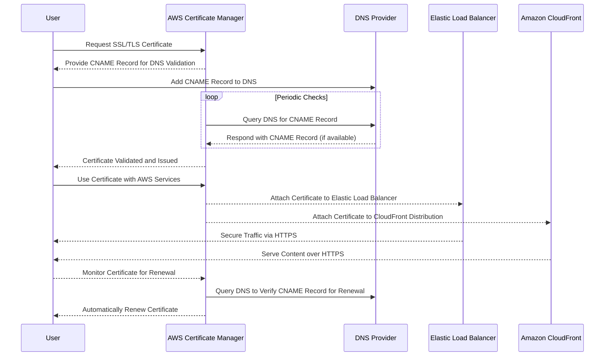
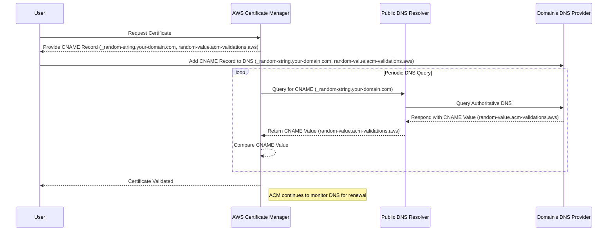

# Creating Certificates using AWS Certificate Manager

## Table of Contents

- [Introduction](#introduction)
- [What is AWS Certificate Manager (ACM)?](#what-is-aws-certificate-manager-acm)
- [Prerequisites](#prerequisites)
- [How It Works?](#how-it-works)
- [Under the Hood: DNS Validation](#under-the-hood-dns-validation)
- [Step-by-Step Guide to Creating Certificates](#step-by-step-guide-to-creating-certificates)
    - [Requesting a Certificate](#requesting-a-certificate)
    - [Validating Your Certificate](#validating-your-certificate)
- [Using ACM Certificates with AWS Services](#using-acm-certificates-with-aws-services)
    - [Using with Elastic Load Balancer (ELB)](#using-with-elastic-load-balancer-elb)
    - [Using with Amazon CloudFront](#using-with-amazon-cloudfront)
- [Best Practices](#best-practices)
- [Key Takeaways](#key-takeaways)
- [Conclusion](#conclusion)
- [References](#references)

## Introduction

Welcome to this comprehensive guide on creating and managing SSL/TLS certificates using **AWS Certificate Manager (ACM)**. ACM is a service that helps you easily provision, manage, and deploy SSL/TLS certificates for securing your websites, APIs, and other resources hosted on AWS. This document will guide you through the step-by-step process of creating certificates in ACM, explaining key concepts like domain validation, certificate renewal, and best practices for certificate management.

## What is AWS Certificate Manager (ACM)?

AWS Certificate Manager (ACM) is a service that allows you to easily manage SSL/TLS certificates to secure your resources. It removes the complexity associated with manually handling certificate provisioning, validation, renewal, and deployment. You can use ACM certificates with AWS services like Elastic Load Balancers (ELB), CloudFront, and API Gateway without extra configuration.

**Why use ACM?**
- Automates the process of certificate management.
- No cost for public SSL/TLS certificates.
- Automatic certificate renewals.
- Integration with other AWS services.

## Prerequisites

Before you begin, ensure you have the following:
- An **AWS Account** with the necessary permissions to access ACM.
- Access to the **AWS Management Console**.
- A **domain name** you control (if you're validating via DNS or email).

## How It Works?

Here's a detailed sequence diagram illustrating how the process of requesting, validating, and using an ACM certificate works under the hood:



### Process Breakdown

1. **Requesting the Certificate**: The user requests a certificate through AWS Certificate Manager (ACM).
2. **Validation Process**: ACM generates a CNAME record that the user adds to their DNS provider. ACM periodically checks the DNS to verify this record and issues the certificate once validated.
3. **Using the Certificate**: The validated certificate can then be attached to services like Elastic Load Balancers (ELBs) and CloudFront distributions to secure web traffic.
4. **Automatic Renewal**: ACM automatically renews the certificate as long as the DNS CNAME record remains in place.

## Under the Hood: DNS Validation

When AWS ACM performs DNS validation "under the hood," it follows a series of steps to ensure that you own the domain associated with the certificate request. Below is a high-level breakdown of how this process works internally:

### 1. **CNAME Record Generation**

- When you request a certificate from ACM, it generates a **CNAME record** that needs to be added to your domain's DNS settings. The CNAME looks something like this:
    - **Name**: `_random-string.your-domain.com`
    - **Value**: `random-value.acm-validations.aws`

This CNAME is a unique identifier that ACM uses to check domain ownership. It contains randomized parts for security and uniqueness, ensuring that only you can prove control of the domain.

### 2. **Public DNS Query**

- ACM needs to verify that the CNAME record is correctly added to the DNS settings. 
- ACM sends a **DNS query** to one of the public DNS resolvers to look up this CNAME record.
- It works by following DNS resolution processes:
    - **Step 1**: Query the top-level domain (TLD) servers (e.g., `.com`, `.org`) for the domain's authoritative name server.
    - **Step 2**: Query the authoritative name server for the DNS record `_random-string.your-domain.com`.
    - **Step 3**: Verify the returned CNAME value (`random-value.acm-validations.aws`).

### 3. **DNS Resolution Using AWS Global Infrastructure**

- AWS uses its global infrastructure to perform these DNS queries. Typically, ACM would reach out to **Amazon Route 53** if your domain is hosted on Route 53, or to any other DNS provider managing your domain.
- If you're using a non-Route 53 DNS service, ACM still sends a query to the public DNS resolvers to retrieve the CNAME record and check if it matches the expected value (`random-value.acm-validations.aws`).

### 4. **ACM Validates the Certificate**

- If the CNAME record is found and matches the expected value, ACM validates the certificate.
- If ACM cannot find the CNAME record, it will keep querying periodically for a set duration until either the DNS record is added and validated, or the certificate request fails due to a timeout.

### 5. **Security Measures**

- The CNAME record is unique for each certificate request, and it’s designed to prevent attackers from spoofing the validation process. The combination of random strings and values ensures that only the rightful domain owner can complete the validation.
- ACM only checks for this CNAME record during the validation period, and it’s unnecessary after the certificate is validated (though keeping the record ensures automatic renewal).

### Visualization:

Imagine you request a certificate for `your-domain.com`. ACM gives you a DNS CNAME record like this:

```
Name: _random-string.your-domain.com
Value: random-value.acm-validations.aws
```

Now, here’s what happens under the hood:

1. You add this CNAME record to your domain's DNS.
2. ACM initiates a DNS lookup for `_random-string.your-domain.com`.
3. The lookup reaches your DNS provider (or Route 53 if you're using it).
4. ACM checks that the returned value (`random-value.acm-validations.aws`) matches the expected value.
5. Once the match is confirmed, ACM marks the certificate as **validated**.

ACM continues to monitor the DNS for this CNAME in the future for **automatic renewal**.

### Sequence Diagram:



## Step-by-Step Guide to Creating Certificates

### Requesting a Certificate

1. **Navigate to ACM Console**:

- Open the [AWS Management Console](https://aws.amazon.com/console/) and search for **AWS Certificate Manager (ACM)**.

2. **Request a Public Certificate**:

- Click on **Request a Certificate**.
- Choose **Request a public certificate** and click **Next**.

3. **Enter Domain Names**:

- Add the domain name(s) you want the certificate for (e.g., `yourdomain.com`, `*.yourdomain.com` for wildcard).
- Click **Next**.

4. **Choose Validation Method**:

- Select either **DNS validation** or **Email validation**. (DNS validation is recommended for its automation benefits.)
- Click **Next**.

5. **Review and Request**:

- Review your domain names and validation method.
- Click **Confirm and request**.

### Validating Your Certificate

Once you've requested a certificate, you'll need to validate that you own the domain. ACM offers two methods:

#### DNS Validation

1. **Get CNAME Record**:

- ACM will provide you with a CNAME record.
- Example:

```bash
Name: _random-string.yourdomain.com
Value: random-value.acm-validations.aws
```

2. **Add the CNAME to Your DNS**:

- Go to your DNS provider (Route 53 or any other) and add the CNAME record provided by ACM.

3. **Automatic Validation**:

- Once the DNS record is added, ACM will automatically validate the certificate within minutes.

#### Email Validation

1. **Choose Email Addresses**:

- ACM will send validation emails to specific administrative emails for the domain (e.g., `admin@yourdomain.com`).

2. **Click Validation Link**:

- Open the email and click the link to validate ownership.

3. **ACM Certificate Issuance**:

- Once you confirm the validation, ACM will issue the certificate.

## Using ACM Certificates with AWS Services

After your certificate is issued, you can use it with various AWS services. Here are some common use cases:

### Using with Elastic Load Balancer (ELB)

1. Go to the **EC2 Console** and navigate to **Load Balancers**.
2. Select your load balancer, and under the **Listeners** tab, add HTTPS support.
3. Choose the ACM certificate from the dropdown to secure traffic.

### Using with Amazon CloudFront

1. Navigate to the **CloudFront Console** and select your distribution.
2. Under the **SSL Settings**, choose to use **ACM Certificate** for HTTPS traffic.
3. Select the certificate you created from the dropdown.

## Best Practices

- **Use DNS validation**: It is automated and allows certificates to renew without manual intervention.
- **Leverage wildcard certificates**: If you have multiple subdomains, wildcard certificates (e.g., `*.yourdomain.com`) reduce the need to manage individual certificates.
- **Enable certificate renewal notifications**: Though ACM automatically renews certificates, set up SNS alerts for certificate renewal failures to ensure uninterrupted service.
- **Monitor certificate expiration**: Regularly check certificate status to avoid disruptions due to expired certificates.

## Key Takeaways

- ACM simplifies SSL/TLS certificate management by automating the validation, issuance, and renewal processes.
- DNS validation is highly recommended for its automation benefits.
- ACM certificates are free for use with AWS services, providing a cost-effective way to secure resources.
- Certificates created in ACM can be easily deployed to AWS services like ELB, CloudFront, and API Gateway.

## Conclusion

Using AWS Certificate Manager (ACM) makes it easy to secure your websites and applications with SSL/TLS certificates, helping you protect your data and provide secure experiences to users. By following this guide, you can quickly request, validate, and manage certificates. Always ensure to follow best practices for secure and efficient certificate management, and leverage ACM’s automation capabilities for hassle-free certificate renewals.

## References

- [AWS Certificate Manager Documentation](https://docs.aws.amazon.com/acm/index.html)
- [Best practices - AWS Certificate Manager](https://docs.aws.amazon.com/acm/latest/userguide/acm-bestpractices.html)
- [How DNS Works](https://docs.aws.amazon.com/Route53/latest/DeveloperGuide/welcome-dns-service.html)
- [SSL certificates for your Application Load Balancer](https://docs.aws.amazon.com/elasticloadbalancing/latest/application/https-listener-certificates.html)