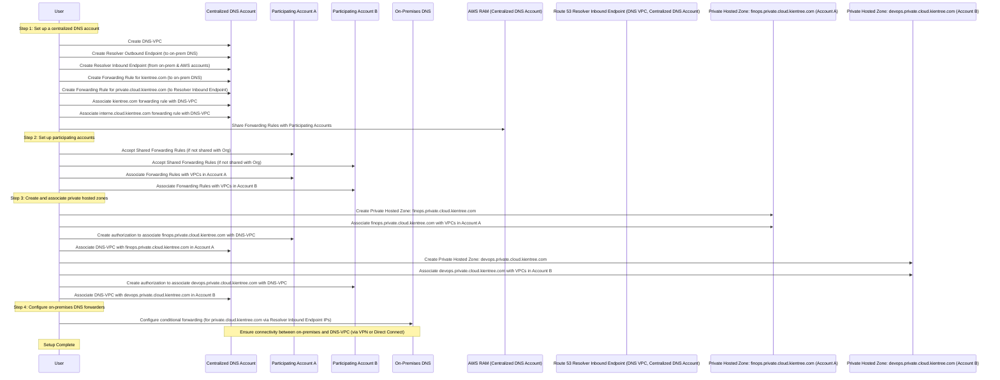
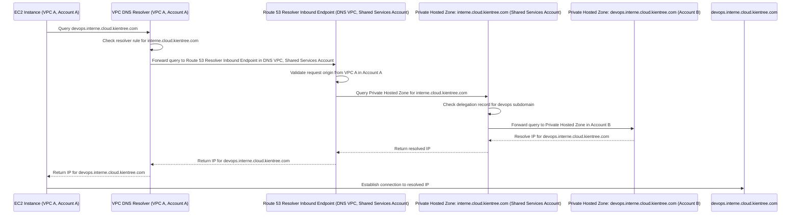

# Setting Up Cross-Account DNS Resolution with AWS RAM and Route 53 Resolver

Welcome to the comprehensive guide on configuring cross-account DNS resolution using AWS Resource Access Manager (RAM) and Route 53 Resolver! This document is designed to help you set up and manage DNS resolution across multiple AWS accounts, specifically focusing on private hosted zones. By following this guide, you will learn how to leverage AWS RAM and Route 53 Resolver to create a seamless, secure, and scalable DNS architecture that meets your organizational needs. This guide includes detailed steps, best practices, and a sequence diagram to ensure a smooth setup process.

## Table of Contents

- [Introduction](#introduction)
- [Components of Route 53 Resolver](#components-of-route-53-resolver)
- [Sequence Diagram for cross-account DNS resolution](#sequence-diagram-for-cross-account-dns-resolution)
- [How to deploy the solution](#how-to-deploy-the-solution)
- [Conclusion](#conclusion)
- [References](#references)

## Introduction

In a multi-account AWS environment, ensuring seamless and secure DNS resolution across accounts can be complex. AWS Route 53 Resolver, combined with AWS Resource Access Manager (RAM), offers a robust solution to enable cross-account DNS resolution, specifically for private hosted zones. By leveraging Route 53 Resolver and RAM, you can streamline DNS management, enhance resource accessibility, and maintain control over private domain resolutions within and across your accounts. This guide provides a step-by-step walkthrough of configuring cross-account DNS resolution, highlighting essential concepts, setup requirements, and best practices to build a scalable and efficient DNS architecture tailored to your organizational needs.

## Components of Route 53 Resolver

### Inbound and Outbound Endpoints

- **Inbound Endpoint**: Receives DNS queries from external sources (such as other AWS accounts) and resolves them within AWS.
- **Outbound Endpoint**: Forwards DNS queries from AWS to external DNS servers.

### Resolver Rules

Resolver rules specify how Route 53 Resolver handles queries:
- **Forward Rules**: Forward DNS queries for specific domains to designated endpoints.
- **System Rules**: Automatically route queries within AWS (e.g., for AWS services).

## Sequence Diagram for cross-account DNS resolution

Below is the sequence diagram illustrating the setup process for cross-account DNS resolution. This includes:

- **Configuring AWS RAM sharing** across three accounts: Account A, Account B, and the Centralized DNS Account.
- **Setting up the Route 53 Resolver Inbound Endpoint** in the Centralized DNS Account.
- **Configuring resolver rules** in each account.
- **Establishing private hosted zone delegation** to ensure seamless DNS resolution across accounts.



## How to deploy the solution

### Step 1: Set up a Centralized DNS Account

The first step in creating a streamlined DNS environment is to establish a centralized DNS account. Here, you'll set up key resources like the DNS-VPC, resolver endpoints, and forwarding rules.

1. **Create DNS-VPC**:
- Set up a dedicated VPC for DNS services (`DNS-VPC`) that suits your network design, such as one with public and private subnets. This VPC acts as a central hub for DNS queries across accounts.
- Reference: [Amazon VPC User Guide](https://docs.aws.amazon.com/vpc/latest/userguide/).

2. **Create Resolver Endpoints**:
- Create an **outbound endpoint** to forward DNS queries to on-premises DNS servers.
- Create an **inbound endpoint** to accept DNS queries from on-premises workloads and other AWS accounts.

3. **Create Forwarding Rules**:
- Set up a rule to forward `kientree.com` DNS queries to your on-premises DNS server IP.
- Set up another rule to forward `private.cloud.kientree.com` queries to the inbound resolver endpoint.
- **Example**:

```shell
aws route53resolver create-resolver-rule --rule-type FORWARD --domain-name "kientree.com" --target-ips "Ip=<on-premises DNS IP>" --resolver-endpoint-id <outbound-endpoint-id>
```

4. **Share Forwarding Rules**:
- Use AWS Resource Access Manager to share these rules across accounts. You can share with specific accounts or your entire AWS Organization.
- **Note**: Ensure connectivity between your on-premises data center and DNS-VPC using a site-to-site VPN or AWS Direct Connect.

### Step 2: Set up Participating Accounts

Each AWS account participating in the DNS solution must be configured to use the shared forwarding rules and have its own private hosted zone.

1. **Accept Shared Rules**:
- In each account, accept the forwarding rules shared via AWS Resource Access Manager.

2. **Associate Forwarding Rules**:
- Associate the rules with VPCs hosting workloads in each participating account to start resolving on-premises domains.

### Step 3: Create Private Hosted Zones

In this step, set up private hosted zones in each participating account and associate them with the centralized DNS-VPC for cross-account DNS resolution.

1. **Create Private Hosted Zone**:
- In each participating account, create a private hosted zone with a unique subdomain of `private.cloud.kientree.com`. Use unique names for each private hosted zone to avoid domain conflicts in your environment (for example, `devops.private.cloud.kientree.com` or `finops.private.cloud.kientree.com`).

2. **Associate Private Hosted Zone with DNS-VPC**:
- Authorize and associate each private hosted zone with the DNS-VPC to enable centralized DNS resolution across accounts.
- **Example**:

```shell
aws route53 create-vpc-association-authorization --hosted-zone-id <hosted-zone-id> --vpc VPCRegion=<region>,VPCId=<vpc-id>
aws route53 associate-vpc-with-hosted-zone --hosted-zone-id <hosted-zone-id> --vpc VPCRegion=<region>,VPCId=<vpc-id>
```

### Step 4: Configure On-premises DNS Forwarders

To allow on-premises workloads to resolve AWS private domain names, set up DNS forwarding from on-premises DNS servers to Route 53 Resolver endpoints.

**Set Conditional Forwarding Rules**:
- Configure your on-premises DNS forwarder to direct `private.cloud.kientree.com` queries to the IP addresses of the resolver inbound endpoints created in Step 1.
- **Connectivity Note**: Ensure continuous connectivity between your on-premises environment and DNS-VPC (e.g., via VPN or Direct Connect).

## How It Works?

Here is an example of how an EC2 instance in Account A queries a domain name in Account B, and the traffic is forwarded to the Route 53 Resolver Inbound Endpoint in the Shared Services Account, which then resolves the query:



### Explanation of Key Steps

1. **EC2 Instance Query**:

- The EC2 instance in VPC A (Account A) initiates a DNS query for `devops.interne.cloud.kientree.com`.

2. **VPC DNS Resolver**:

- The VPC DNS Resolver in VPC A checks the resolver rule for `interne.cloud.kientree.com`.
- It forwards the query to the Route 53 Resolver Inbound Endpoint in the DNS VPC of the Shared Services Account.

3. **Route 53 Resolver Inbound Endpoint**:

- The Resolver Inbound Endpoint validates the request origin from VPC A in Account A.
- It queries the Private Hosted Zone for `interne.cloud.kientree.com` in the Shared Services Account.

4. **Private Hosted Zone in Shared Services Account**:

- The Private Hosted Zone checks the delegation record for the `devops` subdomain.
- It forwards the query to the Private Hosted Zone in Account B.

5. **Private Hosted Zone in Account B**:

- The Private Hosted Zone in Account B resolves the IP address for `devops.interne.cloud.kientree.com`.
- It returns the resolved IP to the Private Hosted Zone in the Shared Services Account.

6. **Return Resolved IP**:

- The Private Hosted Zone in the Shared Services Account returns the resolved IP to the Resolver Inbound Endpoint.
- The Resolver Inbound Endpoint returns the IP to the VPC DNS Resolver in VPC A.
- The VPC DNS Resolver returns the IP to the EC2 instance.

7. **Establish Connection**:

- The EC2 instance establishes a connection to the resolved IP for `devops.interne.cloud.kientree.com`.

## References

- [AWS Route 53 Resolver Documentation](https://docs.aws.amazon.com/route53/latest/dnsresolver/)
- [AWS Private Hosted Zones Documentation](https://docs.aws.amazon.com/Route53/latest/DeveloperGuide/hosted-zones-private.html)
- [Considerations when working with a private hosted zone](https://docs.aws.amazon.com/Route53/latest/DeveloperGuide/hosted-zone-private-considerations.html)
- [AWS Resource Access Manager Documentation](https://docs.aws.amazon.com/ram/latest/userguide/)
- [Scaling DNS management across multiple accounts and VPCs](https://docs.aws.amazon.com/fr_fr/whitepapers/latest/hybrid-cloud-dns-options-for-vpc/scaling-dns-management-across-multiple-accounts-and-vpcs.html)
- [Simplify DNS management in a multi-account environment with Route 53 Resolver](https://aws.amazon.com/blogs/security/simplify-dns-management-in-a-multiaccount-environment-with-route-53-resolver/)
- [Handling Private Hosted Zones in R53](https://crishantha.medium.com/handling-private-hosted-zones-in-r53-3fbcdcd047e1)