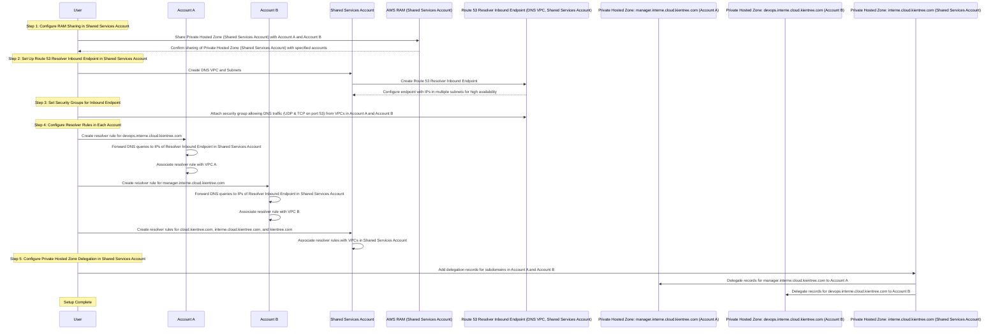

# Setting Up Cross-Account DNS Resolution with AWS RAM and Route 53 Resolver

Welcome to the comprehensive guide on configuring cross-account DNS resolution using AWS Resource Access Manager (RAM) and Route 53 Resolver! This document is designed to help you set up and manage DNS resolution across multiple AWS accounts, specifically focusing on private hosted zones. By following this guide, you will learn how to leverage AWS RAM and Route 53 Resolver to create a seamless, secure, and scalable DNS architecture that meets your organizational needs. This guide includes detailed steps, best practices, and a sequence diagram to ensure a smooth setup process.

## Table of Contents

- [Introduction](#introduction)
- [Components of Route 53 Resolver](#components-of-route-53-resolver)
- [Sequence Diagram and Setup Steps](#sequence-diagram-and-setup-steps)
- [Conclusion](#conclusion)
- [References](#references)

## Introduction

In a multi-account AWS environment, ensuring seamless and secure DNS resolution across accounts can be complex. AWS Route 53 Resolver, combined with AWS Resource Access Manager (RAM), offers a robust solution to enable cross-account DNS resolution, specifically for private hosted zones. By leveraging Route 53 Resolver and RAM, you can streamline DNS management, enhance resource accessibility, and maintain control over private domain resolutions within and across your accounts. This guide provides a step-by-step walkthrough of configuring cross-account DNS resolution, highlighting essential concepts, setup requirements, and best practices to build a scalable and efficient DNS architecture tailored to your organizational needs.

## Components of Route 53 Resolver

### Inbound and Outbound Endpoints

- **Inbound Endpoint**: Receives DNS queries from external sources (such as other AWS accounts) and resolves them within AWS.
- **Outbound Endpoint**: Forwards DNS queries from AWS to external DNS servers.

### Resolver Rules

Resolver rules specify how Route 53 Resolver handles queries:
- **Forward Rules**: Forward DNS queries for specific domains to designated endpoints.
- **System Rules**: Automatically route queries within AWS (e.g., for AWS services).

## Sequence Diagram and Setup Steps

Below is the sequence diagram illustrating the setup process for cross-account DNS resolution. This includes:

- **Configuring AWS RAM sharing** across three accounts: Account A, Account B, and the Shared Services Account.
- **Setting up the Route 53 Resolver Inbound Endpoint** in the Shared Services Account.
- **Configuring resolver rules** in each account.
- **Establishing private hosted zone delegation** to ensure seamless DNS resolution across accounts.

### Explanation of Each Step

1. **Step 1: Configure RAM Sharing in the Shared Services Account**:

- **Shared Services Account** uses **AWS RAM** to share the `interne.cloud.kientree.com` private hosted zone with **Account A** and **Account B**.
- This setup enables both Account A and Account B to access the records in the `interne.cloud.kientree.com` hosted zone without needing their own RAM configurations.
- By centralizing the hosted zone in the Shared Services Account, each account can access this parent domain and any delegated subdomains.

2. **Step 2: Set Up Route 53 Resolver Inbound Endpoint in the Shared Services Account**:

- The user creates a **DNS VPC** in the Shared Services Account with **subnets in multiple Availability Zones** to ensure high availability for DNS query resolution.
- Within this VPC, the user configures a **Route 53 Resolver Inbound Endpoint**. This endpoint serves as a central point for handling DNS queries forwarded from Account A and Account B.

3. **Step 3: Set Security Groups for the Inbound Endpoint**:

- The user attaches a **security group** to the Inbound Endpoint to allow incoming DNS traffic (UDP and TCP on port 53) from the **VPCs in Account A and Account B**.
- This security group setup ensures that DNS queries from Account A and Account B are accepted by the Inbound Endpoint, enabling cross-account DNS resolution.

4. **Step 4: Configure Resolver Rules in Each Account**:

- **Account A** creates a **resolver rule** for the `devops.interne.cloud.kientree.com` subdomain, forwarding these DNS queries to the **Resolver Inbound Endpoint** in the Shared Services Account.
- **Account B** creates a **resolver rule** for the `manager.interne.cloud.kientree.com` subdomain, also forwarding queries to the **Resolver Inbound Endpoint** in the Shared Services Account.
- The **Shared Services Account** sets up **resolver rules** for `cloud.kientree.com`, `interne.cloud.kientree.com`, and `kientree.com` to enable direct DNS resolution within its own VPCs.

5. **Step 5: Configure Private Hosted Zone Delegation in the Shared Services Account**:

- The user adds **delegation records** within the `interne.cloud.kientree.com` private hosted zone in the Shared Services Account.
- These delegation records direct specific subdomains to the private hosted zones in Account A and Account B:
    - **`manager.interne.cloud.kientree.com`** is delegated to the private hosted zone in **Account A**.
    - **`devops.interne.cloud.kientree.com`** is delegated to the private hosted zone in **Account B**.
- This delegation enables the Shared Services Account to route DNS queries for each subdomain to the appropriate account, allowing Account A and Account B to resolve each other’s subdomains via the Shared Services Account’s hosted zone.

## How It Works?

Here is an example of how an EC2 instance in Account A queries a domain name in Account B, and the traffic is forwarded to the Route 53 Resolver Inbound Endpoint in the Shared Services Account, which then resolves the query:

### Explanation of Key Steps

1. **EC2 Instance Query**:

- The EC2 instance in VPC A (Account A) initiates a DNS query for `devops.interne.cloud.kientree.com`.

2. **VPC DNS Resolver**:

- The VPC DNS Resolver in VPC A checks the resolver rule for `interne.cloud.kientree.com`.
- It forwards the query to the Route 53 Resolver Inbound Endpoint in the DNS VPC of the Shared Services Account.

3. **Route 53 Resolver Inbound Endpoint**:

- The Resolver Inbound Endpoint validates the request origin from VPC A in Account A.
- It queries the Private Hosted Zone for `interne.cloud.kientree.com` in the Shared Services Account.

4. **Private Hosted Zone in Shared Services Account**:

- The Private Hosted Zone checks the delegation record for the `devops` subdomain.
- It forwards the query to the Private Hosted Zone in Account B.

5. **Private Hosted Zone in Account B**:

- The Private Hosted Zone in Account B resolves the IP address for `devops.interne.cloud.kientree.com`.
- It returns the resolved IP to the Private Hosted Zone in the Shared Services Account.

6. **Return Resolved IP**:

- The Private Hosted Zone in the Shared Services Account returns the resolved IP to the Resolver Inbound Endpoint.
- The Resolver Inbound Endpoint returns the IP to the VPC DNS Resolver in VPC A.
- The VPC DNS Resolver returns the IP to the EC2 instance.

7. **Establish Connection**:

- The EC2 instance establishes a connection to the resolved IP for `devops.interne.cloud.kientree.com`.

## References

- [AWS Route 53 Resolver Documentation](https://docs.aws.amazon.com/route53/latest/dnsresolver/)
- [AWS Private Hosted Zones Documentation](https://docs.aws.amazon.com/Route53/latest/DeveloperGuide/hosted-zones-private.html)
- [AWS Resource Access Manager Documentation](https://docs.aws.amazon.com/ram/latest/userguide/)