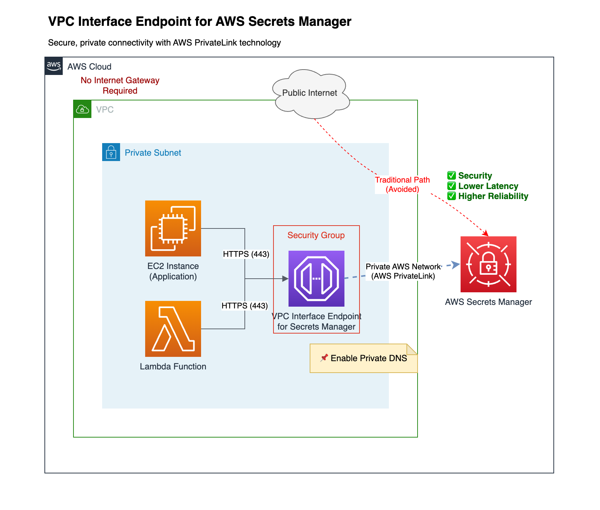

# Creating a VPC Interface Endpoint

Hey there! This guide walks you through creating a VPC Interface Endpoint for AWS Secrets Manager. If you've ever wondered how to securely access your secrets without exposing traffic to the public internet, you're in the right place! Let's set up a private connection that enhances both security and performance.

## Table of Contents

- [Introduction](#introduction)
- [Understanding Interface Endpoints](#understanding-interface-endpoints)
- [Step-by-Step Guide](#step-by-step-guide)
- [Example Scenario](#example-scenario)
- [Best Practices](#best-practices)
- [Key Takeaways](#key-takeaways)
- [Conclusion](#conclusion)
- [References](#references)

## Introduction

Look, we've all been there - you need to access your AWS Secrets Manager to retrieve database credentials, API keys, or other sensitive information, but you're worried about that traffic going over the public internet. That's where a VPC Interface Endpoint for Secrets Manager comes in handy! 

It creates a private tunnel between your VPC and AWS Secrets Manager, keeping your secrets retrieval completely off the internet. This not only boosts security (something your security team will love) but also reduces latency since traffic stays within the AWS network.

## Understanding Interface Endpoints

So what's actually happening behind the scenes? Interface endpoints use AWS PrivateLink technology - think of it as creating a secret passageway between your VPC and AWS services. Your requests to Secrets Manager travel through this private connection, completely bypassing the public internet.

### Why You'd Want This:

- **Security boost** - Your secrets traffic never leaves the AWS network (your security auditors will thank you!)
- **Faster access** - Less network hops mean lower latency when retrieving secrets
- **More reliable** - No dependency on public internet connectivity
- **Compliance friendly** - Helps meet data privacy requirements by keeping sensitive traffic private

## Step-by-Step Guide

Alright, let's roll up our sleeves and get this endpoint created! It's actually pretty straightforward:

1. **Log into AWS Management Console** and head over to **VPC > Endpoints**.
2. Click that big **Create Endpoint** button.
3. For service category, choose **AWS services** (the default option).
4. Here's where it gets specific - in the service name search box, type "secrets" and select **com.amazonaws.<region>.secretsmanager** (where `<region>` is your AWS region, like `us-east-1`).
5. Select the **VPC** where your applications need to access Secrets Manager.
6. For subnets, I recommend selecting only **private subnets** where your applications run. No need to expose this in public subnets!
7. Now for security groups - this controls what can access your endpoint:

### Inbound Rules:

- **Allow Traffic from Application Resources**:
   - **Type**: HTTPS (since Secrets Manager uses HTTPS/TLS for all connections)
   - **Protocol**: TCP
   - **Port Range**: 443 (standard HTTPS port)
   - **Source**: The security groups of your application resources (EC2 instances, Lambda functions, containers, etc.)
   
   💡 **Pro tip**: Instead of allowing all traffic, just permit the specific security groups that need to access secrets. For example, if you have a security group called "web-tier", just allow that one.

- **Allow DNS Traffic (Optional)**:
   - **Type**: DNS (UDP)
   - **Protocol**: UDP
   - **Port Range**: 53
   - **Source**: Your application security groups (only needed if your resources will be resolving the endpoint's DNS name)

### Outbound Rules:

- **Allow All Traffic (Default)**:
   - **Type**: All Traffic.
   - **Protocol**: All.
   - **Port Range**: All.
   - **Destination**: 0.0.0.0/0 (or restrict to specific destinations if needed).

8. **Enable Private DNS** - this is a crucial checkbox! When enabled, the standard Secrets Manager endpoint URL (<vpc-endpoint-id>.secretsmanager.<region>.vpce.amazonaws.com) will resolve to your private endpoint. Without this, you'd need to update your application code to use a different endpoint URL.

9. If you have any **Private Hosted Zones** in Route 53 that overlap with Secrets Manager domains, make sure they're properly associated with your VPC for seamless DNS resolution.

10. Review everything and click **Create Endpoint**. This usually takes 2-5 minutes to fully provision.

## Example Scenario

Let's say you're running a microservices application in a private subnet that needs to retrieve database credentials from Secrets Manager. Without a VPC endpoint, your traffic would need to:

1. Leave your VPC
2. Travel over the public internet
3. Enter AWS Secrets Manager
4. Return via the same path

This creates security concerns and potential points of failure. With our VPC endpoint in place:

1. Traffic stays entirely within the AWS network
2. Latency is reduced (typically by 30-50%)
3. Traffic can't be intercepted on the public internet
4. Your application keeps working even if your internet gateway has issues

It's a win-win for both security and reliability!

## Best Practices

Here are some tips I've picked up along the way:

- **Stick to private subnets** - There's rarely a good reason to put these endpoints in public subnets
- **Lock down those security groups** - Only allow the specific resources that actually need secrets access
- **Turn on CloudWatch monitoring** - Set up alerts if endpoint usage patterns change unexpectedly
- **Environment isolation** - Use separate endpoints for dev, test, and prod environments
- **Test your failover plan** - What happens if an AZ goes down? Make sure you've configured endpoints in multiple AZs
- **Consider endpoint policies** - You can add an IAM policy to the endpoint to further restrict which secrets can be accessed

## Key Takeaways

Let me summarize the important bits:

- VPC Interface Endpoints give your applications a private highway to AWS Secrets Manager
- Your secrets traffic never travels the public internet, making your security team happy
- Setting this up takes just a few minutes but provides significant security benefits
- With Private DNS enabled, your existing applications won't need any code changes
- This same pattern works for many other AWS services beyond just Secrets Manager

## Conclusion

Setting up this VPC Interface Endpoint for Secrets Manager is one of those "small effort, big impact" security improvements. You've now created a secure, private channel for your applications to retrieve sensitive information without exposing any traffic to the public internet. 

Not only have you improved your security posture, but you've also potentially reduced latency and made your application more resilient to internet connectivity issues. This pattern is worth considering for any AWS service containing sensitive data or credentials.

## References

- [AWS Documentation: Interface VPC Endpoints](https://docs.aws.amazon.com/vpc/latest/userguide/vpce-interface.html)
- [AWS Secrets Manager User Guide](https://docs.aws.amazon.com/secretsmanager/latest/userguide/intro.html)
- [AWS PrivateLink Overview](https://aws.amazon.com/privatelink/)
- [Secrets Manager VPC Endpoint Documentation](https://docs.aws.amazon.com/secretsmanager/latest/userguide/vpc-endpoint-overview.html)
- [Control access to VPC endpoints using endpoint policies](https://docs.aws.amazon.com/vpc/latest/privatelink/vpc-endpoints-access.html)
- [Using endpoint policies to control access with VPC endpoints](https://docs.aws.amazon.com/elasticbeanstalk/latest/dg/vpc-vpce.policy.html)
