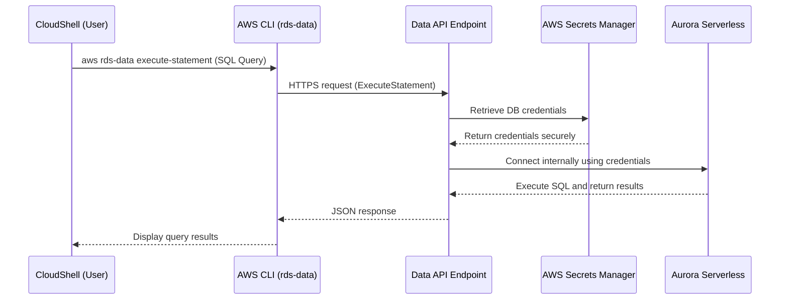
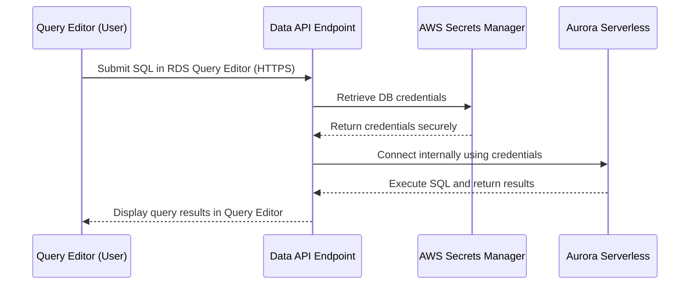

# Using Query Editor with Aurora Serverless V2

## Table of Contents

- [Introduction](#introduction)
- [Prerequisites](#prerequisites)
- [Benefits of Using Query Editor](#benefits-of-using-query-editor)
- [How it works?](#how-it-works)
- [Provisioning an Aurora Serverless V2 Cluster](#provisioning-an-aurora-serverless-v2-cluster)
- [Enabling Query Editor for Aurora Serverless V2](#enabling-query-editor-for-aurora-serverless-v2)
- [Using AWS CloudShell to Manage Aurora Serverless V2](#using-aws-cloudshell-to-manage-aurora-serverless-v2)
- [Accessing the Query Editor](#accessing-the-query-editor)
- [Running Queries](#running-queries)
- [Best Practices](#best-practices)
- [Key Takeaways](#key-takeaways)
- [Conclusion](#conclusion)
- [References](#references)

## Introduction

Amazon Aurora Serverless V2 is a highly scalable and cost-effective relational database solution for modern applications. With the **Query Editor** in the AWS Management Console, you can run SQL queries directly on your Aurora Serverless database without needing to configure additional tools or software. This document will guide you through the process of using the Query Editor, covering setup, usage, and best practices.

## Prerequisites

Before you start using the Query Editor, ensure the following requirements are met:

- **AWS Account:** You need an active AWS account with appropriate IAM permissions.
- **Aurora Cluster:** A provisioned Aurora Serverless V2 cluster must be available.
- **IAM User/Role Permissions:** Ensure you have the necessary permissions to access and manage your RDS resources.
- **Data API Enabled:** The Data API should be turned on for your Aurora Serverless cluster.
- **AWS Secrets Manager Secret:** The Data API requires a secret in AWS Secrets Manager that contains your database credentials (username/password).

## Benefits of Using Query Editor

1. **No Local SQL Client Required** 

- You don’t have to install or configure psql, mysql, or any other database client on your local machine or CloudShell.
- The Query Editor is built right into the AWS Management Console, so you can start querying immediately.

2. **Simple Access and Setup**

- Since it’s in the RDS console, you just select your database instance or cluster, open the Query Editor, and enter valid credentials.
- There’s no need to worry about SSH tunnels, VPNs, or configuring a separate client.

3. **Secure Integration with AWS Services**

- **IAM-Based Access**: You can control who can use the Query Editor through AWS Identity and Access Management (IAM) policies.  
- **Optional Data API Support**: For Aurora Serverless, if you have the Data API enabled, the Query Editor can leverage that HTTPS-based connectivity.  
- **Secrets Manager**: You can store database credentials in AWS Secrets Manager and reference them within the Query Editor, eliminating manual password handling.

4. **No Extra Networking Configuration**

- When you use the Query Editor with Aurora Serverless and the Data API, you don’t need to open inbound ports on your DB’s security group. The Query Editor (through the Data API) communicates with the database internally via AWS’s secure channels.
- With the Data API, you are **not** making a direct TCP (or HTTP/HTTPS) connection to the database. Instead, you make an HTTPS call to an **AWS-managed endpoint** (the Data API endpoint), and AWS internally routes that request to your Aurora Serverless database.  
- This is different from a typical setup where you open port 3306 or 5432 to connect directly via MySQL/PostgreSQL clients.

## How it works?

### CloudShell Use Case



**Flow Explanation**
1. The user in **CloudShell** runs `aws rds-data execute-statement`.  
2. The **AWS CLI** sends an HTTPS request to the **Data API** endpoint.  
3. The Data API fetches credentials from **AWS Secrets Manager**.  
4. The Data API then connects internally to **Aurora Serverless**.  
5. The database runs the query and sends results back to the Data API.  
6. The Data API returns a JSON response to the CLI, which then displays the result to CloudShell.

### Query Editor Use Case



**Flow Explanation**
1. The user types SQL statements directly into the **Query Editor** in the RDS console.  
2. The Query Editor sends an HTTPS request to the **Data API** endpoint.  
3. The Data API retrieves credentials from **AWS Secrets Manager**.  
4. Credentials in hand, the Data API connects to the **Aurora Serverless** database privately inside AWS.  
5. After execution, the DB sends the results back to the Data API.  
6. The Data API returns those results to the Query Editor, displaying them in the console.

## Provisioning an Aurora Serverless V2 Cluster

If you do not already have an Aurora Serverless V2 cluster, follow these steps to provision one:

1. **Navigate to RDS Console:**

- Log in to the AWS Management Console.
- Open the **Amazon RDS** service.

2. **Create Database:**

- Click on **Create Database**.
- Choose **Amazon Aurora** as the engine type.
- Select **Aurora MySQL-Compatible Edition** or **Aurora PostgreSQL-Compatible Edition**.

3. **Configure Database Settings:**

- Enter a **DB cluster identifier** (e.g., `aurora-serverless-cluster`).
- Set the **Master username** and **Master password**.
- **Master Username**
    - **What it is**: The **admin login** used to access and manage the DB instance.
    - **Purpose**: This user has **full privileges** to:
        - Connect to the database instance
        - Create and manage databases
        - Create users, assign roles/permissions
        - Run administrative commands
    - **Required**: You must provide this to create the DB instance
    - **Example**: `admin`, `awsuser`, `root`, `postgreg` (depending on engine and naming rules)

4. **Cluster Storage Configuration:**

- Select the Aurora DB cluster storage configuration that best meets your application's needs in terms of cost predictability and performance.

- **Aurora I/O-Optimized**
    - **Best for**: Applications with high or unpredictable I/O usage (I/O costs > 25% of total DB costs).
    - **Pricing**: Predictable and simplified — includes all I/O operations in the instance and storage pricing.

- **Aurora Standard**
    - **Best for**: Applications with low to moderate I/O usage (I/O costs < 25% of total DB costs).
    - **Pricing**: Pay-as-you-go model for I/O operations.

📕 **Note**: For a typical POC in a development environment, go with Aurora Standard to minimize costs while still having access to all the features you need to validate your application.

5. **DB Instance Configuration:**

- Select **Serverless V2**
- Set the **Minimum Capacity** and **Maximum Capacity** in **Aurora Capacity Units (ACUs)**:
     - **Minimum Capacity**: `0` ACUs (allows pausing during inactivity).
     - **Maximum Capacity**: `2` ACUs (suitable for moderate workloads).

6. **Choose Network and Security Settings:**

- Select a **VPC** and ensure proper subnet configuration.
- Set up the **Security Group** to allow inbound connections (e.g., from your IP).

7. **Additional Settings:**

- **Initial Database Name**
    - **What it is**: The name of the **first database** Amazon RDS will create **inside your DB instance**.
    - **Purpose**: It's just one of potentially many databases you can create later.
    - **Example**: If you set this to `my_dev_database`, RDS will create a database called `my_dev_database` when the instance is created.
    - **Optional**: If left blank, no initial database is created—you can still connect to the instance and create databases manually.
- Leave default configurations unless specific customization is needed.

8. **Create the Cluster:**

- Click on **Create Database** to provision the cluster.
- Wait until the cluster status becomes **Available**.

Once the Aurora Serverless V2 cluster is provisioned, you can proceed to enable the Query Editor.

## Enabling Query Editor for Aurora Serverless V2

To use the Query Editor, you must first configure your database and IAM settings.

1. **Enable Query Editor Feature:**

- Log in to the AWS Management Console.
- Navigate to **RDS Dashboard > Query Editor**.
- Enable the Query Editor option for your database.

2. **Grant IAM Permissions:**

- Attach the necessary policies to the IAM user or role accessing the Query Editor.
- Example IAM policy snippet:

```json
{
    "Version": "2012-10-17",
    "Statement": [
        {
            "Sid": "QueryEditor0",
            "Effect": "Allow",
            "Action": [
                "secretsmanager:GetSecretValue",
                "secretsmanager:PutResourcePolicy",
                "secretsmanager:PutSecretValue",
                "secretsmanager:DeleteSecret",
                "secretsmanager:DescribeSecret",
                "secretsmanager:TagResource"
            ],
            "Resource": "arn:aws:secretsmanager:*:*:secret:rds-db-credentials/*"
        },
        {
            "Sid": "QueryEditor1",
            "Effect": "Allow",
            "Action": [
                "secretsmanager:GetRandomPassword",
                "tag:GetResources",
                "secretsmanager:CreateSecret",
                "secretsmanager:ListSecrets",
                "dbqms:CreateFavoriteQuery",
                "dbqms:DescribeFavoriteQueries",
                "dbqms:UpdateFavoriteQuery",
                "dbqms:DeleteFavoriteQueries",
                "dbqms:GetQueryString",
                "dbqms:CreateQueryHistory",
                "dbqms:UpdateQueryHistory",
                "dbqms:DeleteQueryHistory",
                "dbqms:DescribeQueryHistory",
                "rds-data:BatchExecuteStatement",
                "rds-data:BeginTransaction",
                "rds-data:CommitTransaction",
                "rds-data:ExecuteStatement",
                "rds-data:RollbackTransaction"
            ],
            "Resource": "*"
        }
    ]
}                
```

3. **Database Credentials:** Ensure you have a database user with access to execute queries.

## Using AWS CloudShell to Manage Aurora Serverless V2

### Step 1: Open AWS CloudShell

1. Sign in to the [AWS Management Console](https://console.aws.amazon.com/).

2. Click the **CloudShell** icon in the top navigation bar. This opens a browser-based shell environment with AWS CLI pre-installed.

3. Make sure the AWS region in CloudShell matches the region of your Aurora cluster (you can change regions from the console top bar if needed).

### Step 2: Identify Your Aurora Cluster Information

You’ll need the cluster Resource ARN and confirm the cluster’s identifier and region.

**List RDS Clusters:**

```bash
aws rds describe-db-clusters
```

This returns a JSON description of all your DB clusters. Look for your cluster’s ARN (`DBClusterArn`), cluster identifier (`DBClusterIdentifier`), and note the region.

**Example of Extracting Cluster Identifiers:**

```bash
aws rds describe-db-clusters --query 'DBClusters[].DBClusterIdentifier' --output text
```

If you know your cluster name, you can skip this step. Otherwise, this helps confirm what you have.

### Step 3: Ensure You Have the Needed ARNs

You now need two ARNs:

- **Resource ARN:** Your cluster’s ARN, often in the format: `arn:aws:rds:<region>:<account_id>:cluster:<cluster_identifier>`

- **Secret ARN:** From the secret you created in Secrets Manager.  

Example format: `arn:aws:secretsmanager:<region>:<account_id>:secret:<your-db-secret-name>-<random>`

You can find these in the console or, for the secret:

```bash
aws secretsmanager list-secrets --query 'SecretList[].ARN'
```

(Locate the secret you created for DB credentials.)

### Step 4: Connect to the Database Using the Data API

The Data API doesn’t require a direct network connection to your Aurora cluster. Instead, you call the API endpoint via HTTPS. Thus, you don’t need to modify security groups or open inbound ports for CloudShell.

**Check an Existing Database:**

If you’re using Aurora PostgreSQL, you likely have a default `postgres` database.  
For Aurora MySQL, you can use `information_schema` or another known database.

**Run a Simple Query (e.g., list tables):**

```bash
aws rds-data execute-statement \
    --resource-arn arn:aws:rds:<region>:<account_id>:cluster:<cluster_identifier> \
    --secret-arn arn:aws:secretsmanager:<region>:<account_id>:secret:<your-db-secret> \
    --database postgres \  # For PostgreSQL; use a known DB name
    --sql "SELECT * FROM information_schema.tables;" \
    --region <region>
```

This returns a JSON result set showing all tables visible to the specified database.

### Step 5: Create a New Database

If you want to create a new database inside your Aurora cluster, you can do so via SQL. For PostgreSQL-compatible clusters, run `CREATE DATABASE` from the `postgres` database. For MySQL-compatible clusters, run it from `information_schema`.

**Example (PostgreSQL):**

```bash
aws rds-data execute-statement \
    --resource-arn arn:aws:rds:<region>:<account_id>:cluster:<cluster_identifier> \
    --secret-arn arn:aws:secretsmanager:<region>:<account_id>:secret:<your-db-secret> \
    --database postgres \
    --sql "CREATE DATABASE my_new_database;" \
    --region <region>
```

**Example (MySQL):**

```bash
aws rds-data execute-statement \
    --resource-arn arn:aws:rds:<region>:<account_id>:cluster:<cluster_identifier> \
    --secret-arn arn:aws:secretsmanager:<region>:<account_id>:secret:<your-db-secret> \
    --database information_schema \
    --sql "CREATE DATABASE my_new_database;" \
    --region <region>
```

After running this command, you can verify the new database is created by listing databases again:

**PostgreSQL:**

```bash
aws rds-data execute-statement \
    --resource-arn arn:aws:rds:<region>:<account_id>:cluster:<cluster_identifier> \
    --secret-arn arn:aws:secretsmanager:<region>:<account_id>:secret:<your-db-secret> \
    --database postgres \
    --sql "SELECT datname FROM pg_database;" \
    --region <region>
```

**MySQL:**

```bash
aws rds-data execute-statement \
    --resource-arn arn:aws:rds:<region>:<account_id>:cluster:<cluster_identifier> \
    --secret-arn arn:aws:secretsmanager:<region>:<account_id>:secret:<your-db-secret> \
    --database information_schema \
    --sql "SHOW DATABASES;" \
    --region <region>
```

The new database (`my_new_database`) should appear in the output.

## Accessing the Query Editor

Follow these steps to access the Query Editor:

1. **Navigate to Query Editor:**

- Go to the AWS Management Console.
- Navigate to **RDS > Query Editor**.

2. **Choose Database:**

- Select the desired Aurora Serverless V2 cluster.
- Provide the database username and credentials.

3. **Connect to the Database:**

- Click **Connect** to open the Query Editor interface.

You are now ready to run SQL queries directly within the AWS Console.

## Running Queries

The Query Editor provides an intuitive interface to write and execute SQL statements. You can perform tasks like:

- **Running SELECT queries to retrieve data.**
- **Updating or inserting data.**
- **Creating and altering tables.**

### Example Queries

Here are some simple SQL query examples:

1. **Create a Table:**

```sql
CREATE TABLE employees (
    id INT PRIMARY KEY,
    name VARCHAR(255),
    department VARCHAR(100)
);
```

2. **Insert Data into the Table:**

```sql
INSERT INTO employees (id, name, department) 
VALUES 
    (1, 'John Doe', 'IT'),
    (2, 'Jane Smith', 'HR'),
    (3, 'Emily Johnson', 'Marketing'),
    (4, 'Michael Brown', 'Sales'),
    (5, 'Linda Davis', 'Finance');
```

3. **Select Data from the Table:**

```sql
SELECT * FROM employees WHERE department = 'IT';
```

4. **Update Data in the Table:**

```sql
UPDATE employees 
SET department = 'HR' 
WHERE id = 1;
```

5. **Delete Data from the Table:**

```sql
DELETE FROM employees WHERE id = 1;
```

6. **Review the Changes:**

```sql
SELECT * FROM employees;
```

## Best Practices

To maximize efficiency and security when using the Query Editor, follow these best practices:

1. **Use IAM Policies Wisely:** Grant the least-privilege permissions required for your tasks.
2. **Test Queries in a Non-Production Environment:** Avoid running untested queries directly in production databases.
3. **Monitor Database Performance:** Use CloudWatch metrics to monitor query execution and performance.
4. **Secure Credentials:** Store credentials securely using AWS Secrets Manager or Parameter Store.
5. **Optimize Queries:** Use indexes where appropriate and avoid SELECT * for large tables.

## Key Takeaways

- **Ease of Use:** Query Editor simplifies SQL query execution without additional tools.
- **Scalability:** Aurora Serverless V2 auto-scales to meet application demands.
- **Security:** Use IAM for secure and granular access control.
- **Productivity:** Save time by running queries directly from the AWS Console.

## Conclusion

Thank you for exploring the **Query Editor** with Aurora Serverless V2! The AWS Query Editor is a powerful and user-friendly tool for interacting with Aurora Serverless V2 databases. By following this guide, you can quickly connect to your database, run SQL queries, and optimize performance while adhering to best practices.

## References

- [Amazon Aurora Serverless 2 Documentation](https://docs.aws.amazon.com/AmazonRDS/latest/AuroraUserGuide/aurora-serverless-v2.html)
- [Using the Query Editor in Amazon RDS](https://docs.aws.amazon.com/AmazonRDS/latest/AuroraUserGuide/query-editor.html)